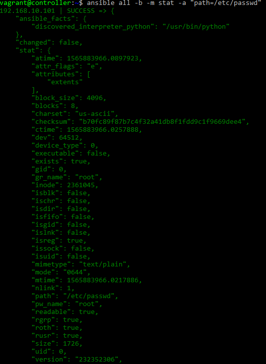
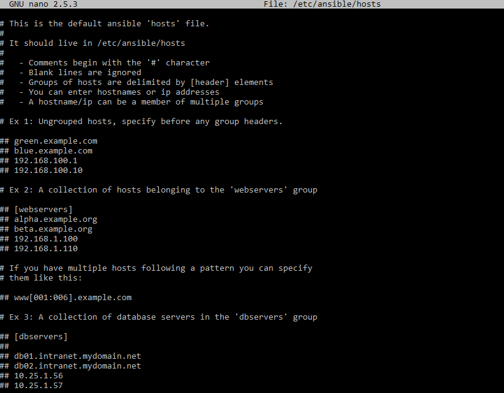
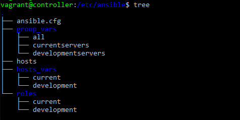

# Index

1. [Origen d' Ansible](#origen)<br>
2. [¿Qué es Ansible?](#ansible)<br>
  2.1 [Principals característiques](#caracteristiques)<br>
  2.2 [Disponibilitat](#disponibilitat)<br>
  2.3 [Arquitectura](#arquitectura)<br>
3. [Ansible Playbooks](#playbooks)<br>
  3.1 [Mòduls PAT, usuaris i grups](#moduls)<br>
  3.2 [Arxius i directoris](#file)<br>
  3.3 [Crons](#crons)<br>
  3.4 [Playbooks i YAML](#yaml)<br>
  3.5 [Estructura de un Playbook](#estructuraplaybook)<br>
  3.6 [Hosts i usuaris](#hostsiusuaris)<br>
  3.7 [Handlers](#handlers)<br>
4. [Iventaris](#inventaris)<br>
  4.1 [Hosts i grups](#hostsigrups)<br>
  4.2 [Hosts i variables](#hostsivars)<br>
  4.3 [Organización de variables](#organitzaciovars)<br>
5. [Organització amb Ansible](#organitzacio)<br>
  5.1 [Includes](#includes)<br>
  5.2 [Roles](#roles)<br>

<a name="origen"></a>  
## 1. Origen d’ Ansible

Va néixer de la necessitat de poder administrador diversos servidors de forma molt més sencilla i fàcil amb el permís de Puppet per automatitzar les tasques d'un "DevOps", això va ser possible gràcies a Michael DeHann, extreballador de Puppet que buscava una eina que és pogués automatitzar, amb potència i escalabilitat. Oficialment Ansible es va llençar el 20 de febrer de l'any 2012.

Com a dada curiosa la paraula "Ansible" va aparèixer per primera vegada en la literatura de ciència-ficció d' Ursula Le Guin l'any 1966 en _El món de Rocannon_ fent referència a un dispositiu de comunicació el qual era més ràpida que la llum i exercia les seves funcions de forma instantània.

<a name="ansible"></a>  
## 2. ¿Qué és Ansible?

Ansible és un software que permet l'automatització, aprovisionament, gestió i el desplegament d'aplicacions en diferents servidors de forma simultània i paral·lela.

**Aquesta eina està categoritzada com a una eina d'orquestració.**

Es una eina de codi obert, Open Source en la que actualment es troba treballant molta gent fet que el fa una eina actualitzada i segura, l'autor de Ansible es Michael DeHaan i té un repositori amb el codi de l'eina allotjada en un Github:

https://github.com/ansible/ansible

A més de ser de codi obert, és gratuïta, ja que utilitza una llicència **GNU GPL v3**, això permet automatitzar la majoria dels elements d'una infraestructura.

Ansible també permet treballar amb els proveïdors del núvol, com AWS, Azure o Google Cloud Platform. Gestionant components com a xarxes, grups de seguretat, adreces IP o claus públiques.


¿Com es connecta Ansible als diferents nodes per a poder gestionar-ho?

Ansible gestiona els diferents nodes associats a ell mitjançant SSH, l'únic requeriment que necessita Ansible és que el servidor remot tingui instal·lat el Python per a poder utilitzar-ho.

¿Com escrivint un projecte amb Ansible?

Utilitza YAML per a descriure les accions a realitzar i configurar les diferents tasques a fer perquè aquestes es puguin propagar als diferents nodes.

<a name="caracteristiques"></a>
### 2.1 Principals característiques d'Ansible

* Aprovisionament
  * Amb Ansible podem aprovisionar-nos de les últimes plataformes disponibles al núvol com hosts virtuals, dispositius de xarxa, físics...

* Gestió de la configuració
  * Podem gestionar totes les nostres configuracions de forma molt ràpida i eficaç, ja que els seus fitxers són molt configurables.

* Orquestació
  * Ansible, fa ús de la seva potencia per poder desplegar i gestionar molts servidors de forma paral·lela simple i segura.

* Desplegament d'aplicacions
  * Amb aquesta característica podem seguir un control del cicle de vida d'una aplicació, aquesta es controla amb un deployment anomenat Ansible Tower.

* Seguretat i compliment
  * Ansible ens dóna la possibilitat de definir la seguretat dels nostres sistemes de forma molt sencilla utilitzant els _Playbooks_ podem definir regles en l'àmbit de Firewall, permisos d'usuaris, carpetes, grups...

<a name="disponibilitat"></a>
### 2.2 Disponibilitat

En l'actualitat Ansible es distribueix en Fedora, Red Hat, Linux, CentOs, i Scientific Linux mitjançant els paquets EPEL (Extra Packages for Enterprise Linux).
A més dels SO anteriorment mencionats, aquesta eina també es troba distribuïda i és podem trobar des de un buscador de paquets: https://goo.gl/y6ad6g


En el nostre cas utilitzaren una màquina virtual i descarregarem l'eina més actual per comandes.
El podem trobar per dispositius Mac no obstant això, **no està disponible per Windows**.

<a name="arquitectura"></a>
### 2.3 Arquitectura de Ansible

Com abans hem comentat Ansible és una eina que serveis per instal·lar, configurar i manejar diferents servidor de forma paral·lela, hem de diferenciar que n'hi ha dos tipus.

- El controlador: Aquesta és la màquina des de la qual comença tot el maneig dels diferents servidor els quals d'alguna forma "penjant d'aquest", en aquest punt comença l'orquestració.

- Nodo: Es maneja pel controlador mitjançant una connexió SSH.


La màquina que realitza la tasca de controlador reconeix als altres nodes mitjançant un inventari, que, per organitzar-ho fa un desplegament de mòduls sobre el protocol SSH, aquest desplegament fa que els mòduls desplegats no siguin controlats pel controlador, sinó que **és la mateixa màquina remota la que s'encarrega de fer-ho** d'aquesta manera la **màquina local no consumeix recursos ni processos executant-se en segon pla.**

Una gran diferencia que podem trobar amb altres programes semblants com Chef o Puppet és que Ansible utilitza una arquitectura **sense agents**, l'arquitectura basada en agents, té com a finalitat instal·lar localment un procés de comunicació amb la màquina que fa de controlador, amb la nova arquitectura de Ansible sense agents, aquests no es necessiten instal·lar als nodes ni executar, ja que aquests mòduls són independents, aquesta arquitectura redueix la càrrega de xarxa i prevé l'ús de control més concretes i potents per part del servidor.


<a name="playbooks"></a>  
## 3. Ansible Playbooks

<a name="moduls"></a>  
### 3.1 Mòdulos PAT, usuaris i grups

__Mòduls - Serveïs__

En Ansible per poder utilitzar un dels seus mòduls que venem predefinits hem de fer ús del paràmetre `-m`.
Alguns d'aquests mòduls podem ser **yum, apt, o service** això ens servirà per instal·lar els nostres programes als nostres diferents nodes.

En aquest senzill exemple procedirem a instal·lar el paquet o mòdul NTP.

`$ansible all -b -m apt -a "name=ntp state=installed"`


Com s' observa en la captura comproven que en el node amb l'IP 192.168.10.101 el paquet NTP ja és troba instal·lat, en canvi en la IP 192.168.10.102 encara no el té, Ansible té l'avantatge que comprova el servidor penjant que no tingui el mòdul i l'instal·la sense donar cap problema de tornar a reinstal·lar el mòdul un altre cop pel servidor.

* Podem desglossar la comanda de la següent manera:
* "-a" En aquest paràmetre procedirem a passar el paquet (name) juntament amb l'estat (state).
* "-b" L'indiquem que volem executar l'ordre com a super usuari (sudo).
* "-m" Es el mòdul en qüestió.

D'aquesta forma ens evitem haver d'anar a cada servidor fer un SSH i instal·lar el paquet.

Ara comproven que segons Ansible el paquet NTP és troba en estat **SUCCESS** que significa que no hi ha hagut cap canvi en les màquines i el mòdul NTP té un **state=installed** correcte.

Si canviem l' *state* per "name=ntp **state=absent"** comprovaren que l'output és que ha eliminat el mòdul, com si és tractés d'un `remove`.


Un cop tenim el nostre paquet NTP instal·lat ja podem procedir a comprovar el seu "Status" amb la comanda `$ansible all -b -a "service ntp status`.


__Usuaris i grups__

Gràcies a Ansible, ara remotament podem administrar, gestionar, crear i modificar usuaris i grups des de el nostre node principal controller, per exemple si nosaltres volguéssim afegir un grup anomenat "ASIX" ho faríem amb la següent comanda amb el mòdul "group":

* `$ansible all -b -m group -a "name=asix state=present"`(En aquest cas el **PRESENT** no vol dir instal·lar, sinó que estigui present).


En la captura es pot observar que Ansible després de crear el grup també et diu el nom d'aquest juntament amb el seu GID, a més he posat una captura amb les dues comandes dues vegades perquè es pugui veure com en la primera part es detecta un canvi i en la segona ens dóna un **SUCCESS** sense cap modificació.

Si ara volem crear un usuari dintre d'un grup, i al mateix temps crear la seva home, deurien de fer-ho de la següent forma amb el mòdul "user":

* `$ansible all -b -m user -a "name=ariel group=asix createhome=yes"`


De la mateixa forma que amb el grup això també ens dona un output amb les diferents variables que tenim del nostre usuari, gid, home i grup.

Comproven que l'usuari existeix com a tal:


Com observen ha creat l'usuari en el servidor amb l'IP acabada en .101, però de la mateixa forma també ho farà en l'altre.

Més informació sobre els usuaris i grups [aquí](https://docs.ansible.com/ansible/latest/modules/user_module.html)


### 3.2 Arxius i directoris

Aquest mòdul es un dels més utilitzats en l'actualitat, ja que gràcies al fet que nosaltres podem tenir diverses configuracions de' Apache, PHP, MySQL... volem mantenir un mateix mòdul que estigui relacionat amb el mateix sistema d'arxius i directoris d'aquesta manera eviten possibles incongruències durant la creació dels directoris o fitxers.

* La comanda per veure l' **ESTAT** del fitxer o directori en qüestió és la següent:

* `$ansible all -b -m stat -a "path=/etc/passwd"`



Mitjançant aquesta comanda podem observa el path del fitxer, si es executable, la seva mida, i moltes altres característiques d'aquest.

* Per **COPIAR** un fitxer partint d'un origen cap a un destí tenim que emplear aquesta linia de codi:

* `$ansible all -b -m copy -a "src=/etc/hosts dest=/home/ariel/hosts`


Com observem es pot veure la mida del fitxer, el seu propietari i la destinació d'aquest.

**Important: si al paràmetre "src" posem una barra `/` al final, només copiarà els fitxers que estiguin dintre del directori cap al destí per el qual la carpeta en si no es copiarà**

Ara utilitzarem el mòdul anomenat **Fetch** que fa el mateix que el copy però descarregar els fitxers cap al nostre controlador.

* Aquesta comanda serveix per **DESCARREGAR** fitxers o directoris, i té el gran avantatge que encara que nosaltres descarreguéssim fitxers de molts nodes **no els sobreescriurà**.

* `$ansible all -b -m fetch -a "src=/home/ariel/hosts dest=/home/vagrant"`


Com podem observar ens crea dos directoris amb l'IP dels nostres servidors.

Per la creació modificació de fitxers i carpetes, juntament amb altres paràmetres d'aquests utilitzarem el mòdul "FILE".

* En aquest petit exemple crearem un **FITXER** amb els permissos 644.

* `$ansible all -b -m file -a "dest=/home/ariel/prova1 mode=644 state=touch"`


* Per crear una **CARPETA** utilitzarem la següent comanda.

* `$ansible all -b -m file -a "dest=/home/ariel/ASIX mode=644 state=directory"`


Comproven que existeixen:


* Si volem eliminar un fitxer o carpeta només deuríem de posar en **state=absent**.

* `$ansible all -b -m file -a "dest=/home/ariel/ASIX mode=644 state=absent"`


Per veure més informació sobre els paràmetres a posar, [aqui](https://docs.ansible.com/ansible/latest/modules/file_module.html).


### 3.3 Crons en Ansible

Les tasques que funcionen de forma periòdica dintre de un sistema s'administren per crons, normalment per editar crons executen la comanda `crontab -e` però amb Ansible aquesta tasca es torna una cosa molt més senzilla gràcies al mòdul "cron".

* Per exemple si volem crear un cron que executi un script cada dia a les 12 AM utilitzarem la següent comanda:

* `$ansible all -u root -m cron -a "name='cron-asix' hour=12 job='/script.sh"`


Comproven que existeix el cron en els nostres nodes.


En la imatge observem que és un cron creat per Ansible amb el nom escollit per nosaltres.

Més informació sobre els diferents paràmetres a posar en els crons d'Ansible al següent enllaç: [Crons Ansible](https://docs.ansible.com/ansible/latest/modules/cron_module.html)

<a name="yaml"></a>
### 3.4 Playbooks i YAML

__Playbooks__

En Ansible, els _playbooks_ ens proporciona una manera molt diferent de poder utilitzar Ansible. A diferència de les comandes que podem introduir en consola, els _playbooks_ es podem personalitzar en un fitxer i mantenir un control d'aquests amb molt facilitat fent ús dels inventaris, tags, rols, handlers, etc.

Aquests _playbooks_ fam que l'eina Ansible pugui ser molt senzilla per als SysAdmin o DevOps si volem convertir els nostres Scripts en diferents "Plays" per poder composar un _playbook_.

```
---
- hosts: webservers
  vars:
    http_port: 80
    max_clients: 200
  remote_user: root
  tasks:
  - name: ensure apache is at the latest version
    yum:
      name: httpd
      state: latest
  - name: write the apache config file
    template:
      src: /srv/httpd.j2
      dest: /etc/httpd.conf
    notify:
    - restart apache
  - name: ensure apache is running
    service:
      name: httpd
      state: started
  handlers:
    - name: restart apache
      service:
        name: httpd
        state: restarted
```

Un _playbook_ està compost de "Plays". Els "Plays" tenem com a objectiu buscar i trobar diferents servidors amb uns determinats rols els quals venem representats amb diferents tasques.

__YAML__

Ansible utilitza el llenguatge YAML perquè és molt més senzill d'entendre que altres formats com XML o JSON.

En Ansible molts d'aquests fitxers YAML comencen a una **llista** que conté un ítem, i aquest mateix té les propietats de clau o valor.

**A tenir en compte**, en YAML tots els fitxers comencen per (---) i acaben amb (...).

Totes les cadenes d'string en YAML que portin un espai tenen que anar entre cometes:

```
---
# Descripció del gos
firulais:
  - descripció: "Té problemes d'atenció cap al seu amo"
  - raça: Spitz #Aquesta no va entre cometes
...
```

En el següent exemple veurem com declarar aquestes llistes: 

```
---
# Llista de cursos en ASIX
  - "Base de dades"
  - Xarxes
  - Virtualització
...
```

Com podem observar en la llista anterior, tots els elements començen amb un guió, i per fer comentaris amb una almohadilla #.

Els diccionaris es representen en format clau-valor, això també ho podem combinar amb llistes:

```
---
# Alumne
ariel:
  - nom: "Ariel Zambrano"
  - correu: "azambrano@sapalomera.cat"
  - curs: "2nd ASIX"
  - direcció:
    - "Carrer Pep Ventura"
    - "Numero 4"
    - "Pis 3-1"
  - assignatures:
    - pendents:
              - "Base de dades"
              - Sistemes
              - PHP
    - acabades:
              - Virtualització
              - Xarxes
...
```

Encara que pugui ser menys visible, aquestes llistes i diccionaris podem resumir-ho com si és tractés d'un format JSON.

```
---
# Alumne
ariel: {nom: "Ariel Zambrano", correu: "azambrano@sapalomera.ca"t, curs: "2nd ASIX"}
# Llista de assignatures pendents
assignatures: ['base de dades', 'PHP', 'Serveis']
...
```

Per últim i no menys important **les variables** amb Ansible que totes tenem que anar representades d' aquesta forma ""{{ variable }}":

```
---
home: "home/ariel"
ruta: "/etc/{{ home }}" #Aquesta variable "home" té el mateix contigut que la propietat clau-valor d'amunt.
...
```

<a name="estructuraplaybook"></a> 
### 3.5 Estructura d'un playbook

Per començar a entendre el que és un playbook hem de recordar que un play no és res més que una sèrie de rols que utilitza Ansible per trobar uns determinats servidors els quals són representats amb tasques, aquests plays en conjunt formen el que anomenem playbooks.


El play s'encarrega de trucar al servidor que nosaltres en indicat dintre del codi YAML, aquest tipus de plays ens permeten orquestrar molts tipus de nodes encara que no tinguin res a veure y fer les modificacions necessàries si així ho volguéssim.

En el següent exemple nosaltres amb aquests dues comandes instal·lariem apache al nostre servidor:

`sudo apt-get install apache2`
`sudo service apache2 start`

Però amb el següent playbook de Ansible ho podriem fer de forma paral·lela a tots els nostres servidors al mateix temps que iniciem el serveï:

```
---
hosts: all
remoute_user: root
tasks:
  - name: Instal·lar Apache en la seva última versió
  apt: name= apache2 state=latest
  - name: Inciciar el nostre Apache
  service: name=apache2 state=started enabled=yes
...
```

Un cop hem fet això podem executar la nostra comanda amb la comanda `ansible-playbook + fitxer.yml` d'Ansible.


Com podem veure en la captura l'execució es divideix en vàries parts, la primera és la _Play_ que executarà a tots els hosts que li hem dit, després es troba els _Gathering Facts_ que s'encarrega de distribuir els paquets als dos allotjaments, després observen la _Task_ que en aquest cas li hem posat com a nom "Instal·lar Apache en la seva última versió" i per últim el _Play recap_ que es la notificació final que ens dóna Ansible sobre la correcta instal·lació del paquet.

Com hem comentat abans un playbook pot contenir varies plays, en el següent exemple instal·laré sobre el servidor Apache del servidor .101 un servidor DNS mentes que pel servidor .102 desinstal·laré l'Apache i posaré un balancejador de càrrega "Haproxy".


__Llista de tasques en un Playbook__

Les _Plays_ podem contenir una llista de tasques com pot ser l'instal·lació d'un paquet, l'inici/finalització d'un servei, etc. Però aquestes tasques s'executen en ordre i només es pot fer una al mateix temps, **és important saber que l'ordre de les tasques és el mateix per tots els nodes** d'aquesta manera podem concloure que amb Ansible si una tasca falla, aquesta es torna a executar un altre cop obtenint com a resultat que un mòdul que s'ha executat vàries vegades tingui el mateix efecte com si se hagués realitzat un sol cop.

Totes les tasques tenen que tenir obligatòriament un `name`que el podrem veure a l'output després d'executar la comanda d'Ansible `ansible-playbook`, així podem saber que és el que estem fem.


Per declara una tasca utilitzen els mòduls que pot incloure Ansible, com pot ser el service, apt, order, user... en aquest exemple ens assegurem que el servei d' Apache estigui sempre present i en funcionament.

```
---
- hosts: all
  remote_user: root
  tasks:
    - name: Crear un directori
      shell: name=apache2 state=latest #Mòdul "apt"
    - name: Inciciar el nostre Apache
      service: name=apache2 state=started enabled=yes #Mòdul "service"
...
```

Altres mòduls que s'utilitzem amb freqüència es el `command` i el `shell` aquests a diferència dels altres que hem vist no utilitzem la sintàxis **clau=valor** si no que empra el paràmetre directament de la comanda executada.

```
---
- hosts: all
  remote_user: root
  tasks:
    - name: Crear un directori
      shell: mkdir /home/vagrant/novacarpeta
...
```
__PRE_TASKS i POSTS_TASKS__

En Ansible les tasques també es podem executar abans o després de executar alguna play, per exemple si volem fer un `upgrade` del nostre servidor però abans tenim que fer un `upgrade` ho fariem d'aquesta forma:

Per realitzar una tasca abans de fer la principal farem ús del paràmetre `pre_tasks` i per fer una posterior `post_tasks`.

```
- hosts: 192.168.10.101
  remote_user: root
  pre_tasks:
    - name: Pre tasca
      command: echo "Actualitzant tots els paquets"
  tasks:
    - name: Upgrade server
      apt: name=aptitude state=latest
  post_tasks:
    - name: Post tasca
      command: echo "servidor actualitzat"
...
```


__Opcions d'un Playbook__

Ansible de forma predeterminada té moltes opcions que es troben assignades sense que nosaltres ho sapiguem com pot ser la ruta del nostre inventari o el _verbose_ que ens mostrarà per sortida totes les comandes emprades durant l'execució, tot això es pot modificar gràcies a les opcions següents:

* Per exemple, en Ansible la ruta del nostre inventari és `/etc/ansible/hosts` no obstant podem modificar aquesta ruta perquè apunti cap a un altre fitxer amb la comanda `--inventory=/ruta/que/volem' o '(-i PATH)`

En aquesta imatge podem veure com tenim un fitxer a la ruta `/home/vagrant/projecte` i volem executar el nostre playbook per reiniciar els serveis webs, llavors executarem la següent comanda indicant el path del inventari alternatiu:


Com podem veure encara que el host .103 no existeixi Ansible continuarà executant les comandes sense cap mena de problema.

* En aquest segon exemple comprovarem com funciona la comanda `--verbose (-v)` en Ansible perquè ens mostri totes les comandes, podem afegir el paràmetre `-vvvv` per obtenir tots els detalls de l'execució.


* La següent opció és la d'afegir variables durant l'execució del nostre Playbook amb la comanda `--extra-vars=VARS` o `-e VARS` cal recordar que si afegim variables aquestes és tenen que declarar en formar clau-valor **"clau1=valor1,clau2=valor2"**.

* També tenim l'opció d'indicar el tipus de connexió amb la comanda `--connections=TYPE` o `-c TYPE` això fa referència al tipus de connexió que volem fer durant l'execució del playbook, **per defecte és SSH** encara que podem executar el nostre playbook en **local** gràcies a aquesta opció.

* Després tenim l'opció `--check` que ens permet fer una simulació de les nostres comandes per comprovar que s'executen de forma correcta als nostres servidors.

<a name="hostsiusuaris"></a> 
### 3.6 Hosts i usuaris

Com ja hem esmentat abans una play pot contenir una sèrie de tasques a assignar, no obstant hem de tenir en compte **els hosts que volem utilitzar com a objectius per les nostres _plays_.**

Dit d'un altre forma, abans hem utilitzat la comanda `hosts: all` per indicar tots els nostres servidors a utilitzar, no obstant això equival a `hosts: webservers`.

Per altra banda el paràmetre `remote_user` l'utilitzem per indicar l'usuari que s'encarregarà d'executar la nostra play.

Aquests usuaris és podem de definir de forma general o bé per executar tasques **individuals**:

```
---
- hosts: 192.168.10.101
  remote_user: root
  tasks:
    - name: Actualitzar tots els hosts a la seva última versió amb el compte Ariel
      remote_user: ariel
      become: yes
      become_user: www-data
      apt: name=aptitude state=latest
...
```

A més també podem indicar l'ordre a seguir quan executen les tasques en els nostres servidors fen us del mòdul `order`.

* Dintre del mòdul order podem trobar les següents opcions:
 * inventory: s'empra per defecte, s'utilitza l'odre especificat del inventari.
 * reverse_inventory: executa les comandes de forma inversa.
 * sorted: els hosts s'executen de forma alfabetica.
 * reverse_sorted: el mateix que el `sorted` però al contrari.
 * shuffle: els hosts s'ordenen de forma random.

<a name="handlers"></a> 
### 3.6 Handlers

En Ansible els Handlers ens serveixen per poder gestionar les accions de les nostres tasques i així poder modificar els resultats de les nostres accions.

Aquesta acció són llançades al final de cadascuna de les nostres _plays_, si Ansible detecta que hem de reiniciar més d'una vegada només s'executaran un sol cop encara que és cridem vàries vegades.

En el següent exemple nosaltres tenim un servidor sense l'Apache configurat, amb el Handler que hem creat podem llençar una notificació i reiniciar el nostre servei un sol cop.


<a name="inventaris"></a>  
## 4. Inventaris
<a name="hostsigrups"></a>  
### 4.1 Hosts i grups

Dintre d'Ansible existeixen diverses formes d'indicar-li al software les tasques i/o gestions a orquestrar que volem fer.

La més fàcil és ficar les nostres màquines nodes al **inventari que Ansible té dintre del nostre sistema**, aquest inventari es pot localitzar per defecte dintre de `/etc/ansible/hosts`, amb el paràmetre `-i` podem modificar aquest inventari per el que nosaltres vulguem.

Com podem veure dintre del fitxer podem afegir de diverses formes els nostres hosts, partint des de un nom de domini i/o ip, ficar-los dintre d'un grup, aquest és delimiten amb un **header** per crear grups.



Aquest fitxer `hosts` té un format semblant al .ini i els comentaris és fam amb l'almohadilla "#", per posar els nostres dos nodes dintre del nostre inventari els ficarem de la següent forma:


Aquests headers o capçaleres són el nom dels nostres grups de servidors, els quals utilitzarem per separar, classificar i ordenar els diferents servidors dintre d'Ansible per d'aquesta manera poder utilitzar els més convenients segons les nostres necessitats.

```
[webserver]
azambrano.com

[backupserver]
172.100.10.1

[dbserver]
db.asix2.com

```

A més, dintre d'aquest fitxer podem indicar-li la connexió i l'usuari que volem que la faci amb variables, concretament amb els paràmetres `ansible_connection` i `ansible_ss_port`, utilitzarem sempre la sintaxi **clau=valor**.

```
[webserver]
localhost ansible_connection=local
azambrano.com ansible_connection=ssh ansible_user=ariel 

[dbserver]
azambrano.com ansible_ss_port=22 ansible_user=ariel
db.azambrano.com:2222 #També ho podem fer d'aquesta forma.

```

Encara que es pogui utilitzar les variables en aquest fitxer, Ansible recomana declarar les varibles dintre de la carpeta `hosts_vars`.

A més de declarar variables, també podem fer us dels **patrons** per anar per els servidors en comptes de crear llistes.

```
[webserver]
server[a:z]azambrano.com #Recorrem tots els servidors des de la A fins la Z 

[dbserver]
db[1:7].azambrano.com:2222 #També ho podem fer d'aquesta forma amb numeros.

```
<a name="hostsivars"></a>  
### 4.2 Hosts i variables

Les variables dintre d'aquests fitxer podem venir predefinides com les de ansible_connection o ansible_user però també hem podem crear de personalitzades

```
[webserver]
asix.azambrano.com variable1=hola variable2=adeu
```

__Grups de variables__

Com hem vist abans, les variables és podem assignar en format **clau=valor** però a més, aquestes és podem agrupar en les capçaleres dels grups dels nostres servidors `[webserver:vars]`, és possible crear grups de grups utilitzant el sufix `:children` encara que també podem mantenir les variables personalitzades per crear aquest grup de variables.

Per posar un cas pràctic en el següent diagrama tenim una estructura d'un cas real amb Ansible, on tenim un servidor de logs, de BBDD, web y servidors corrents que formen part en una empresa però que se situen en diferents llocs del món tots aquests es configuren de la mateixa manera.


En el nostre inventari deurien de tenir diferents entrades per controlar el mapa de xarxa anterior.

```
#Aquests correspondriem als servidors web
[azambrano-web]
www1.azambrano.com
www2.azambrano.com

#En aquest grup indicariem que la connexión cap als nostres servidors web d'amunt ho farem amb SSH
[azambrano-web:vars]
ansible_connection=ssh

#Servidors de base de dades empleant un patro per agafar tots dos.
[azambrano-db]
db[1:2].azambrano.com

[azambrano-log]
logs.azambrano.com

[azambrano-nodes]
bcn.asix.com
madrid.asix.com

[azambrano-nodes:vars]
ansible_user=vagrant # Farem la connexió als nostrers servidors nodes amb l'usuari Vagrant
```

Un cas real en el que podem utilitza la variable `grup:children` es per agrupar tots els nostres servidors segons el sistema operatiu emprat.

```
[ubuntu:children]
azambrano-web #Aqui posarem el nom del grups
azambrano-nodes #Agrupa els servidors bcn.asix.com i madrid.asix.com

[debian:children]
azambrano-logs
azambrano-db
```
Aquests grups "Children" té dues propietats principals:
* El hosts membre d'un grup fill, formarà art del grup pare automàticament.
* Les variables del grup fill sobreescriuen les del grup pare.

Amb tot el que hem vist podem deduir que aquesta manera de treballar amb els fitxers _Hosts_ fa que el manteniment i control dels nostres servidors amb Ansible sigui una tasca molt més eficaç i especifica.

__Grups per defecte__

En l'inventari per defecte existeixen dos grups: `all` que conté tots els hosts i `ungrouped` el qual agrupa tots els hosts que no tenen associat cap grup.


<a name="organitzaciovars"></a>  
### 4.3 Organització de les variables

Encara que les variables es poguin posar dintre del fitxer `/etc/ansible/hosts` en la bona pràctica Ansible recomana dividar aquestes dues seccions, ja que en el cas del fitxer _hosts_ té la funció d'inventari i no es deuria de fer encara que sigui possible.

Per exemple, el meu sistema sistema de fitxers es el següent:



* La carpeta `group_vars` ens serveix per posar una sèrie de servidors amb variables en comú d'aquesta manera tindran el mateix lloc d'entorn i configuració.
  * Podem observar el fitxer `all` on podem crear variables per tots els servidors.
  
  ```
  #Zona horaria
  init_timezone: "Europe/Madrid"
  
  #Usuari i grup  predifinit
  init_users_add:
  - {name: www-data, group: www-data, uid:1, gid:1, home: /var/www}
  
  ```
  
  **Important, les mateixes variables que siguin predifinides en arxius que estiguin dintre de /group_vars com pot ser `developmentserves` sobreescriuran les del fitxer `all`.**

* En la carpeta `hosts_vars` anirà totes les variables de cadascun dels nostres servidors de forma individual.

En la següent imatge veurem que Ansible busca en les carpetes `/hosts_vars` i `/group_vars` per unir aquestes variables. Dintre del fitxer development que es troba **dintre** de `roles` només hem d'indicar-li el nom del fitxer en qüestió:

``` development
[currentservers] #Nom del fitxer que es troba dintre de /etc/ansible/group_vars/currentservers
development ansible_host=192.168.10.101 ansible_connection=ssh ansible_user=root #nom del fitxer "development" que es troba en /host_vars
```
<a name="organitzacio"></a>
## 5. Roles e includes
<a name="includes"></a>
### 5.1 Includes

Com ja hem vist abans dintre de un fitxer _Playbook_ podem enmagatzemar molta informació, tasques, variables a fer, però una forma molt més eficaç de poder organitzar i reutilitzar els nostres de fitxer de configuració YAML seria utilitzar includes per poder utilitzar parts molt més petites de fitxers molt grans.

__Include de tasques__

Per exemple, el nostre fitxer original de `apache-playbook.yml` té aquesta estructura:

```
---
- hosts: all
  remote_user: root
  tasks:
    - name: Instal·lar Apache en la seva última versió
      apt: name=apache2 state=latest
    - name: Inciciar el nostre Apache
      service: name=apache2 state=started enabled=yes
...
```

Amb els includes ho podem deixar d'aquesta manera:

```
---
- hosts: all
  remote_user: root
  tasks:
    - include: apache-include.yml
...
```

Com ja tenim les variables de `remote_user` i `hosts` el notre fitxer `apache-include.yml` que el contingut que anirà a l'include deuria de quedar de la següent manera:

```
---
- name: Instal·lar Apache en la seva última versió
  apt: name=apache2 state=latest
- name: Inciciar el nostre Apache
  service: name=apache2 state=started enabled=yes
...
```
Amb això podriem reutilitzar aquest codi per qualsevol altre projecte amb el que tinguen que instal·lar l'Apache.

__Include de handlers__

Aquest mateix include per l'instalació del Apache també es pot combinar amb els Includes dels Handlers.

Fitxer `includehandlers.yml`

```
- name: Iniciar PHP
  service: name=php state=started enabled=yes
- name: Iniciar Apache
  service: name=apache2 state=restarted enabled=yes
```
El resultat de la nostra configuració amb tasques i handlers seria el seguent:

```
---
- hosts: all
  remote_user: root
  tasks:
    - include: apache-playbook.yml
  handlers:
    - include: includehandlers.yml #Include del nostre handler.
...
```
__Include de playbooks__

També tenim la possibilitat de incluir altres playbooks dintre de un mateix playbook utilitzant la mateixa sintaxis, en el següent cas afegirem includes de les nostres configuracions web, bbdd i backup.

```
---
- hosts: all
  remote_user: root
  include: webserver-playbook.yml
  include: db-playbook.yml
  include: backup-playbook.yml
...
```

<a name="roles"></a>
### 5.2 Roles

Una de les principals prioritats que tenin que tenir amb Ansible és la correcta organització dels nostres fitxers, variables, codi, etc. Ansible per tractar de resoldre aquest problema d'organització i manteniment va implementar els **rols** que són paquets de configuracions que es poden reutilitzar en qualsevol altre servidor.

El rol ens serveix per detectar sistemes operatius, crear variables, templates, arxius de configuració, etc. Dit d'una altre forma, **un rol son includes que es troben configurats de forma estructurada.**

L'estructura de un rol es la següent:

```
webservers.yml #el nom del playbook.
roles/
  common/ #Posarem el nom que volguem
    files/
    templates/
    tasks/
    handlers/
    vars/
    defaults/
    meta/
```

Per cridar un rol amb playbook utilitzariem la seguent sintaxis:

```
---
- hosts: servidorsweb
  roles:
    - bbdd #configuracions de tots els servidors de base de dades
    - apache #configuració dels nostres servidors web
...
```

Perquè un rol pugui **funcionar** a nivell de fitxers i directoris deurà de tenir la següent estructura amb el fitxer **main.yml** aquest fitxer es clau per executar els nostres rols si existeix l'arxiu s'afegirà a la nostra _play_, si no existeix el rol no s'executarà.

Estructura de un rol:

* roles/proyecte/tasks/main.yml #les TASQUES s'afegiran al nostre _Play_
* roles/proyecte/handlers/main.yml #Els HANDLERS s'afegiran al _Play_
* roles/proyecte/vars/main.yml #Les variables del fitxer s'afegiran al _Play_
* roles/proyecte/defaults/main.yml #Els parametres per DEFECTE s'afegiran al _Play_
* roles/proyecte/meta/main.yml #Les dependencies llistas s'afegiran a la llista de rols.

Com he vist tenim que anomenar les carpetes en funció de la seva funció task, handlers, vars... en canvi n'hi han dues carpetas de configuració que son `roles/proyecte/files` (estatics) y `/roles/proyecte/templates` (dinamics) que no cal que tinguin el fitxer main.yml.

Si el directori no existeix, Ansible l'ignora.

__Rols - Variables per defecte__

Com ja hem vist abans les variables per defecte es posem a la ruta `/role/nomdelanostracarpeta/default/main.yml`, aquestes variables tenem la mínima priorirtat entre totes les variables disponibles i les pot sobreescriure qualsevol altre variable d'un rol o del inventari.

__Rols - Dependencies__

Les dependencies ens permeten executar rols dintre de rols, aquest s'enmagatzement en el directori `meta/main.yml`

```
---
dependencies:
  
  - role: common
    vars:
      some_parameter: 3
  - role: apache
    vars:
      apache_port: 80
  - role: postgres
    vars:
      dbname: blarg
      other_parameter: 12
...
```

Aquestes dependencies s'executaran **ABANS** dels rols, per exemple si volem executar el rol d'instal·lar Laravel, deurien de tenir el paquet de PHP instal·lat al nostre servidor.

