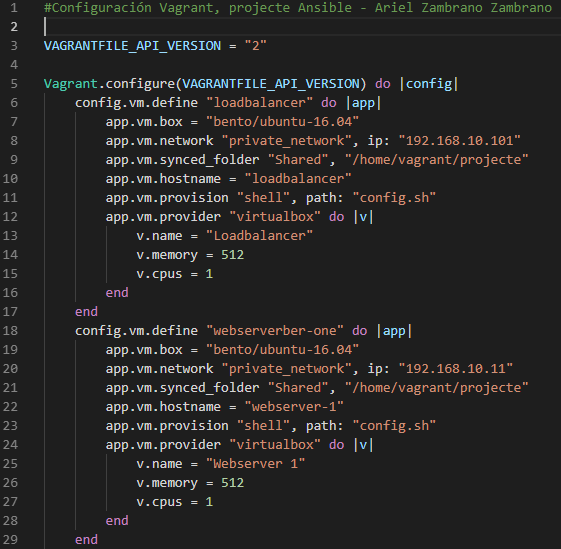
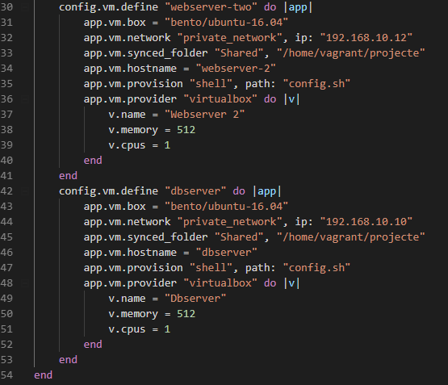

# Annexos

L'estructura que utilitzarem per fer les nostres amb Ansible serà la següent:


Aquesta estructura la farem possible gràcies a l'eina de Vagrant i Ansible.

## Instal·lació en Linux.
Per començar tenim que instal·lar el software de Ansible, per portar-ho a terme llançaren les següents comandes:

`$ sudo apt-add-repository ppa:ansible/ansible`

`$ sudo apt-get Update`

`$ sudo apt-get install ansible`

Al llençar la comanda “sudo apt-get install ansible” ens donarà un error amb el Ubuntu 18.04 per tractar de solventar-ho tenim que llençar la comanda següent

`$ sudo add-apt-repository universe`

<a name="controllernode"></a>
## Configuració de les nostres màquines mitjançant VAGRANT

En el meu cas per a poder gestionar de forma molt més senzilla i ràpida totes les màquines virtuals he fet us de l’eina anomenada Vagrant, ja que no només em deixa la possibilitat de poder instal·lar cuántes màquines vulgui si no que puc implementar l’Ansible de forma més sencilla i ràpida, a més de poder aprofitar el codi per llençar els nodes que implementaré després.

Per començar, en aquest apartat podem veure el fitxer empleat per la configuració de la nostra maquina principal Ansible, podem observar que utilitzen una versió de Ubuntu 16.04, amb una xarxa privada amb l’IP 192.168.10.100, una carpeta compartida Shared que s’ubicarà en l’arrel de el nostre Vagrantfile, memòria ram i CPU. 

__Fitxer d'instalació del servidor amb Ansible__


Si observen el fitxer veurem que hi ha una configuració amb el path “config.sh” això ho utilitzarem per instal·lar el Ansible de forma automàtica a la nostra màquina virtual.


I iniciem el nostre servidor controlador que serà l’encarregat de gestionar els altres nodes, carreguem la configuració del fitxer amb la comanda `vagrant up`.


Ara per veure si la nostra màquina s’ha configurat correctament fem un SSH cap a l’IP del nostre servidor.


__Fitxer d'instalació dels servidors nodes__

En aquest fitxer veurem la configuració del Loadbalancer, els dos servidors web i el de BBDD.





<a name="ssh-passwd"></a>
## Habilitació del SSH i contrasenya per la correcta gestió de Ansible

Un dels problemes que té l’administració remota es la continua petició de les credencials alhora d’introduir una comanda de Ansible, aquesta tasca pot ser molt feixuga si tenim molts nodes no volem que sempre ens demani la contrasenya, així que per obviar-lo haurem d’ **habilitar** per el nostre node principal **l' autorització i copia de la contrasenya root** dels altres servidores cap al servidor principal Ansible, d’aquesta forma farem que Ansible pugui accedir de forma correcta:

Primer de tot autoritzarem l’autorització per ssh del usuari root per els nostres nodes dintre del fitxer `/etc/ssh/sshd_config`, canviarem el prohibit password per **yes** `permitrootlogin YES`:


Per últim reiniciem el servei i amb això ja ens podriem logear amb l'usuari root.

`$ sudo service ssh restart`

Un cop habilitat el SSH per root a els nostres nodes, tenim que activar i modificar la contrasenya dels nostres hosts que penjaram del servidor principal.


Per tal de poder obtenir les mateixes credencials de root en tots els nodes utilitzarem la següent comanda en el **controlador** que ens crearà una nova clau:

`$$ ssh-keygen –t rsa` (Aquesta comanda el que fa es generar unes claus per el ssh-copy-id)


Ara afegirem la contrasenya root dels nostres nodes dintre del nostre host-controlador Ansible:

`$vagrant@cotroler: ssh-copy-id root@192.168.10.101` #Ip del sevidor de càrrega (Loadbalancer)

També cal tenir present que no sempre realitzarem tasques com a root de forma que també copiarem la contrasenya del usuari, en aquest cas serà el de Vagrant.

`$vagrant@cotroler: ssh-copy-id vagrant@192.168.10.101` << Aquesta comanda s'ha d'emprà a tots els nodes per evitar problemes de connexió  amb les comandes de Ansible.

<a name="comandasbasicas"></a>
## Primeres comandes bàsiques de Ansible (Comandes AD-HOC)

Ansible té la gran facilitat de deixar de banda les tasques antigues con per exemple tenir que entrar per SSH a cadascun dels nostres servidors descarregar el WordPress, Apache o qualsevol altre servici e instal·lar-ho de forma seqüencial un per un, amb unes sencilles comandes podem realitzar un manteniment e instal·lació dels nostres serveis de forma paral·lela i conjunta de tots els nostres nodes de forma segura i evitant així problemes d’ incongruència.

Abans de fer qualsevol tasca relacionada amb Ansible tenim que comprovar que els nostres nodes **es troben sincronitzats per data i hora** a més **comprovarem que tenim els recursos suficients per executar una aplicació.**, això es coneix con comandes *AD-HOC*.

* Comprovació del hostname de tots els nodes de forma paralela amb Ansible:
  * `$ansible all -a "hostname"` --> Aquesta comanda té com a funció dir-nos els hostname de totes les màquines que es troven controlades per Ansible, aquesta comanda equival a `$ansible 192.168.10.101,192.168.10.10,192.168.10.11,192.168.10.12 -a "hostname"`.

  

Per defecte, Ansible executa les comandes de forma paral·lela per acabar abans, si tenim dos servidors com es el cas, no notarem la diferente però si afegim més servidors comprovare que funciona més ràpid si paral·lelitzem.

* Per comprovar la execució de comades de forma sequencial utilitzarem el paràmetre "-f 1".
  * `$ansible all -a "hostname" -f 1` (Aquest paràmetre només s'utilitza quan tinguem molts servidors i el nostre ample de banda no sigui molt bo, per això es recomana que per les xarxes més lentes utilitzin aquest paràmetre.

  

* També podem observar l'espai dels nostres servidors com si fos una comanda cap al nostre servidor local.
  * `$ansible all -a "df -h"`

  

* Comprovació de la nostra memòria cau per poder comprovar que tenim espai suficient per poder instalar un WordPress o Apache.
  * `$ansible all -a "free -m"`
 
### FACTS

Els facts son els detalls de un servidor o grup de servidors, aquesta comanda ens permet obtenir una llista exhaustiva dels detalls del nostres nodes.

Per exemple en les següents captures podem veure les IPs del nostre servidor, la data y hora amb segons, el mes, el SO, la Home, entre altres caràcteristiques.


<a name="loadbalancer"></a>
## Instalació del servidor HAProxy

Per instal·lar el meu servidor HAProxy he recreat la següent estructura en el meu directori de Ansible.

```
├── ansible.cfg
├── group_vars
│   ├── all.yml
│   └── loadbalancers.yml
├── hosts
├── hosts_vars
│   └── loadbalancer.yml
├── loadbalancers.yml
├── logs
│   └── ansible.log
└── roles
    └── haproxy
        ├── defaults
        │   └── main.yml
        ├── handlers
        │   └── main.yml
        ├── tasks
        │   └── main.yml
        └── templates
            └── haproxy.cfg.j2
```

* Fitxer d'instal·lació de les **tasques** per el serveï de HAProxy `roles/haproxy/tasks/main.yml`

```
---
- name: Asegurar que HAProxy es troba instal·lat
  apt: name=haproxy  state=installed

- name: Asegurar que HAProxy es troba preent
  lineinfile:
    dest: /etc/default/haproxy
    regexp: "^ENABLED.+$"
    line: "ENABLED=1"
    state: present

- name: Copiar configuració HAProxy cap al fitxer de configuració
  template:
    src: haproxy.cfg.j2
    dest: /etc/haproxy/haproxy.cfg
    mode: 0644
    validate: haproxy -f %s -c -q #Asegurar que la configuració es valida.
  notify: restart haproxy

- name: Asegurar que HAProxy es troba habilitat
  service: name=haproxy state=started enabled=yes
...
```

* Fitxer d'instal·lació de **les variables** de HAProxy dintre de `roles/haproxy/templates/haproxy.cfg.j2`. Aquest fitxer .j2 (Jinja 2) ems servirà per afegir variables per poder configurar la nostra plantilla de HAProxy.

```
global
  log /dev/log  local0
  log /dev/log  local1 notice
  stats socket {{ haproxy_socket }} level admin
  chroot {{ haproxy_chroot }}
  user {{ haproxy_user }}
  group {{ haproxy_group }}
  daemon

        # Default SSL material locations
        ca-base /etc/ssl/certs
        crt-base /etc/ssl/private

        # Default ciphers to use on SSL-enabled listening sockets.
        # For more information, see ciphers(1SSL). This list is from:
        #  https://hynek.me/articles/hardening-your-web-servers-ssl-ciphers/
        ssl-default-bind-ciphers ECDH+AESGCM:DH+AESGCM:ECDH+AES256:DH+AES256:ECDH+AES128:DH+AES:ECDH+3DES:DH+3DES:RSA+AESGCM:RSA+AES:RSA+3DES:!aNULL:!MD5:!DSS
        ssl-default-bind-options no-sslv3

defaults
        log     global
        mode    http
        option  httplog
        option  dontlognull
        timeout connect 5000
        timeout client  50000
        timeout server  50000
        errorfile 400 /etc/haproxy/errors/400.http
        errorfile 403 /etc/haproxy/errors/403.http
        errorfile 408 /etc/haproxy/errors/408.http
        errorfile 500 /etc/haproxy/errors/500.http
        errorfile 502 /etc/haproxy/errors/502.http
        errorfile 503 /etc/haproxy/errors/503.http
        errorfile 504 /etc/haproxy/errors/504.http

frontend {{ haproxy_frontend_name }}
    bind {{ haproxy_frontend_bind_address }}:{{ haproxy_frontend_port }}
    mode {{ haproxy_frontend_mode }}
    default_backend {{ haproxy_backend_name }}

backend {{ haproxy_backend_name }}
    mode {{ haproxy_backend_mode }}
    stats enable
    stats uri /haproxy?stats
    stats realm Strictly\ Private
    stats auth root:root
    balance {{ haproxy_backend_balance_method }}
    balance roundrobin
    option httpclose
    option forwardfor
    
        server {{ backend.name }} {{ backend.address }} check port 80
    
```

* Fitxer per defecte de les configuracions del HAProxy dintre de `roles/haproxy/defaults/main.yml`.

```
---
haproxy_socket: /var/lib/haproxy/stats
haproxy_chroot: /var/lib/haproxy
haproxy_user: haproxy
haproxy_group: haproxy

# Frontend configuració.
haproxy_frontend_name: 'projecteansible'
haproxy_frontend_bind_address: '*' # A totes les direccions
haproxy_frontend_port: 80 #Escoltar per el port 80
haproxy_frontend_mode: 'http' #Només escoltarà les peticions per HTTP

# Backend configuració.
haproxy_backend_name: 'projecteansible' 
haproxy_backend_mode: 'http'
haproxy_backend_balance_method: 'roundrobin'
haproxy_backend_httpchk: 'HEAD / HTTP/1.1\r\nHost:localhost'

# List of backend servers.
# Crearem un diccionari
haproxy_backend_servers:
  - name: webserver-one
    address: 192.168.10.11:80
  - name: webserver-two
    address: 192.168.10.12:80
```

* Fitxer del nostre Handler

```
---
- name: restart haproxy
  service: name=haproxy state=restarted
...
```

<a name="webserversapache"></a>
## Instal·lació i configuració dels servidors web amb Apache.

Estructura a nivell de fitxers del rol `Apache`.

```
├── ansible.cfg
├── group_vars
│   ├── all.yml
│   └── webservers.yml
├── hosts
├── hosts_vars
│   ├── webserver-one.yml
│   └── webserver-two.yml
├── webservers.yml
├── logs
│   └── ansible.log
└── roles
    └── apache
        ├── defaults
        │   └── main.yml
        ├── handlers
        │   └── main.yml
        ├── tasks
        │   └── main.yml
        └── templates
            └── vhosts.conf.j2
```

* Fitxer de les nostres **tasques** `roles/apache/tasks/main.yml`

```
---
- name: Asegurar que l'Apache es troba instal·lat
  apt: name={{ item }} state=installed
  with_items: "{{ apache_packages }}"

- name: Habilitar modul #Modulos
  file:
    src: "{{ apache_server_root }}/mods-available/{{ item }}"
    dest: "{{ apache_server_root }}/mods-enabled/{{ item }}"
    state: link
  with_items: "{{ apache_mods_enabled }}"
  notify: restart apache2

- name: Add virtual hosts configuration #Ficheros
  template:
    src: "{{ apache_vhosts_template }}"
    dest: "{{ apache_conf_path }}/sites-available/{{ apache_vhosts_filename }}"
    owner: root
    group: root
    mode: 0644
  notify: restart apache2 #Handler

- name: Add enabled virtuals hosts #Hosts virtuals
  file:
    src: "{{ apache_conf_path }}/sites-available/{{ apache_vhosts_filename }}"
    dest: "{{ apache_conf_path }}/sites-enabled/{{ apache_vhosts_filename }}"
    state: link
  notify: restart apache2

- name: Remove default virtual hosts in sites-enabled
  file:
    path: "{{ apache_conf_path }}/sites-enabled/000-default.conf"
    state: absent
  notify: restart apache2
...
```

* Fitxer de configuració de les nostres variables `etc/ansible/roles/apache/defaults/main.yml`

```
---

# Paquets a instal·lar per defecte diccionari

apache_packages:
  - apache2
  - apache2-utils

apache_mods_enabled:
  - rewrite.load

#Configuració Apache amb Ubuntu 16.04

apache_daemon: apache2
apache_daemon_path: /usr/sbin/
apache_server_root: /etc/apache2
apache_conf_path: /etc/apache2

#Configuracións
apache_vhosts_filename: "vhosts.conf"
apache_vhosts_template: "vhosts.conf.j2"

#Ips que escoltará
apache_listen_ip: "*"
apache_listen_port: 80

apache_global_vhost_settings:
  DirectoryIndex index.php index.html home.html

apache_vhosts:
 - servername: "azambrano.com"
   documentroot: "{{ webserver_root }}" #Variable que será compartida per els Rols de Apache i PHP

apache_allow_override: "All"
apache_options: "-Indexes +FollowSymlinks"

...
```

* Fitxer de configuració de la nostra plantilla (Template) de Apache `etc/ansible/roles/apache/templates/vhosts.conf.j2`

```
{{ apache_global_vhost_settings }}


<VirtualHost {{ apache_listen_ip }}:{{ apache_listen_port }}>
  ServerName {{ vhost.servername }}

  ServerAlias {{ vhost.serveralias }}


  DocumentRoot "{{ vhost.documentroot }}"



  ServerAdmin {{ vhost.serveradmin }}


  <Directory "{{ vhost.documentroot }}">
    AllowOverride {{ vhost.allow_override | default(apache_allow_override) }}
    Options {{ vhost.options | default(apache_options) }}
    Require all granted

  </Directory>
</VirtualHost>



```

* Fitxer Handler de Apache `etc/ansible/roles/apache/handlers/main.yml`
```
---
- name: restart apache2
  service:
    name: apache2
    state: restarted
...
```

<a name="php"></a>
## Instal·lació i configuració del rol PHP.

* Fitxer de les **tasques** de PHP `etc/ansible/roles/php/tasks/main.yml`

```
---

- name: Install PHP packages
  apt: name={{ item }} state=installed
  with_items: "{{ php_packages }}"
  notify: restart apache2
...
```

* fitxer de les **variables per defecte** de PHP `etc/ansible/roles/php/defaults/main.yml`

```
---

php_packages:
  - php7.0
  - libapache2-mod-php7.0
  - php7.0-mysql
  - php7.0-curl
...
```
<a name="mysql"></a>
## Instal·lació i configuració del MySQL

* Fitxer de les variables per defecte de MySQL `etc/ansible/roles/mysql/defaults/main.yml`

```
---

- name: Instal·lar els paquets MySQL
  apt: name={{ item }} state=installed update_cache=yes
  with_items: "{{ mysql_packages }}"

- name: Copiar mysqld.conf cap el servidor bbdd
  template:
    src: mysqld.conf.j2
    dest: "{{ mysql_conf_dir }}/mysql.conf.d/mysqld.cnf"
  notify: "restart mysql"

- name: Iniciar servei MySQL
  service: name=mysql state=started enabled=yes

- name: Actualitzar contrasenya root
  mysql_user:                          #Mòdul de Ansible
    name: root
    password: root
    host: "{{ item }}"
  with_items:
    - 127.0.0.1
    - ::1
    - localhost
  when: ansible_hostname == 'localhost'

#Quan no sigui localhost
- name: Actualitzar contrasenya root quan no sigue localhost
  mysql_user: name=root password=root host={{ item }}
  with_items:
    - "{{ ansible_hostname }}"
    - 127.0.0.1
    - ::1
    - localhost
  when: ansible_hostname != 'localhost'

- name: Copiar .my.cnf para las credencials root
  template:
    src: .my.cnf.j2
    dest: ~/.my.cnf
    mode: 0600
  notify: "restart mysql"

- name: Asegurar-se que no hi han usuarios anonims bbdd
  mysql_user: name='' host={{ item }} state=absent
  with_items:
    - localhost
    - "{{ ansible_hostname }}"

- name: Crear Base de dades
  mysql_db: name={{ item.name }} state=present
  with_items: "{{ mysql_db }}"
  when: mysql_db|lower() != 'none'

- name: Crear usuarios BBDD
  mysql_user: name={{ item.name }} password={{ item.password }} priv={{ item.priv }} host=% state=present
  with_items: "{{ mysql_users }}"
```

* Fitxer de configuració de les nostres variables per defecte:

```
#Configuració amb Ubuntu 16.04
mysql_packages:
  - mysql-server
  - python-mysqldb
  - python-selinux


#Directori per defecte MySQL
mysql_conf_dir: "/etc/mysql"

#Port per defecte
mysql_port: 3306

#Adreça per defecte per poder accedir als nostres hosts
mysql_bind_address: "0.0.0.0"

#Variable de usuari root
mysql_root_pass: root

#Nom de les nostres bbdd
mysql_db:
  - name: wpazambrano

#Usuari WordPress
mysql_users:
  - name: wpariel
    password: P@ssw0rd
    priv: "*.*:ALL"

```

* Fitxer de configuració de la nostra plantilla `mysqld.conf.j2`:

```
## Fitxer per defecte

[mysqld_safe]
socket          = /var/run/mysqld/mysqld.sock
nice            = 0

[mysqld]
user            = mysql
pid-file        = /var/run/mysqld/mysqld.pid
socket          = /var/run/mysqld/mysqld.sock
port            = {{ mysql_port }}
basedir         = /usr
datadir         = /var/lib/mysql
tmpdir          = /tmp
lc-messages-dir = /usr/share/mysql
skip-external-locking
# adreçes
bind-address            = {{ mysql_bind_address }}


key_buffer_size         = 16M
max_allowed_packet      = 16M
thread_stack            = 192K
thread_cache_size       = 8
myisam-recover-options  = BACKUP
query_cache_limit       = 1M
query_cache_size        = 16M


# Path del error log
log_error = /var/log/mysql/error.log
max_binlog_size   = 100M
```

* Fitxer de configuració per les credencials de root `.my.cnf.j2`:

```
[client]
user=root
password={{ mysql_root_pass }}
```

* Handler per reiniciar el mysql server:

```
---
- name: restart mysql
  service: name=mysql state=restarted
...
```

Comproven que fa la correcta connexió amb el software Toad.

bbdd3.png

Ens assegurem de que la BBDD estigui creada

bbdd4.png

<a name="wordpress"></a>
## Instal·lació i configuració del WordPress

* Fitxer de configuració de les **tasques** a fer per Ansible per WordPress.

```
---

- name: Instal·lar packet unzip
  apt: name=unzip state=installed

- name: Comprovar si WordPress es troba instal·lat
  stat: path="{{ wp_download_path }}"
  register: wp_zipped

- name: Descargar WordPress
  get_url: url="{{ wp_url }}" dest="{{ wp_download_path }}"
  when: wp_zipped.stat.exists == False

- name: Unzip WordPress
  unarchive: src="{{ wp_download_path }}" dest="{{ wp_webserver_path }}" copy=no

- name: Copiar fitxer wp-config.php cap al webserver
  template:
    src: wp-config.php.j2
    dest: "{{ wp_webserver_path }}/wp-config.php"

...

```

* Fitxer de **les variables per defecte**:

```
---
#En el nostre cas la configuració a fer la farem amb la versió 5.2.2 de WordPress

wp_url: "https://es.wordpress.org/latest-es_ES.zip"

#directori on deixarem el .zip
wp_download_path: "/tmp/wordpress-5.2.2.zip"

#Descomprimir el fitxer
wp_webserver_path: "/var/www"
```

* Fitxer de configuració de la **nostra plantilla** `wp-config.php.j2`:

```
<?php
/**
 * The base configuration for WordPress
 *
 * The wp-config.php creation script uses this file during the
 * installation. You don't have to use the web site, you can
 * copy this file to "wp-config.php" and fill in the values.
 *
 * This file contains the following configurations:
 *
 * * MySQL settings
 * * Secret keys
 * * Database table prefix
 * * ABSPATH
 *
 * @link https://codex.wordpress.org/Editing_wp-config.php
 *
 * @package WordPress
 */

// ** MySQL settings - You can get this info from your web host ** //
/** The name of the database for WordPress */
define( 'DB_NAME', '{{ mysqldb }}' );

/** MySQL database username */
define( 'DB_USER', '{{ userdb }}' );

/** MySQL database password */
define( 'DB_PASSWORD', '{{ passworddb }}' );

/** MySQL hostname */
define( 'DB_HOST', '{{ hostdb }}' );

/** Database Charset to use in creating database tables. */
define( 'DB_CHARSET', 'utf8' );

/** The Database Collate type. Don't change this if in doubt. */
define( 'DB_COLLATE', '' );

/**#@+
 * Authentication Unique Keys and Salts.
 *
 * Change these to different unique phrases!
 * You can generate these using the {@link https://api.wordpress.org/secret-key/1.1/salt/ WordPress.org secret-key service}
 * You can change these at any point in time to invalidate all existing cookies. This will force all users to have to log in again.
 *
 * @since 2.6.0
 */
define( 'AUTH_KEY',         'put your unique phrase here' );
define( 'SECURE_AUTH_KEY',  'put your unique phrase here' );
define( 'LOGGED_IN_KEY',    'put your unique phrase here' );
define( 'NONCE_KEY',        'put your unique phrase here' );
define( 'AUTH_SALT',        'put your unique phrase here' );
define( 'SECURE_AUTH_SALT', 'put your unique phrase here' );
define( 'LOGGED_IN_SALT',   'put your unique phrase here' );
define( 'NONCE_SALT',       'put your unique phrase here' );

/**#@-*/

/**
 * WordPress Database Table prefix.
 *
 * You can have multiple installations in one database if you give each
 * a unique prefix. Only numbers, letters, and underscores please!
 */
$table_prefix = 'wp_';

/**
 * For developers: WordPress debugging mode.
 *
 * Change this to true to enable the display of notices during development.
 * It is strongly recommended that plugin and theme developers use WP_DEBUG
 * in their development environments.
 *
 * For information on other constants that can be used for debugging,
 * visit the Codex.
 *
 * @link https://codex.wordpress.org/Debugging_in_WordPress
 */
define( 'WP_DEBUG', false );

/* That's all, stop editing! Happy publishing. */

/** Absolute path to the WordPress directory. */
if ( ! defined( 'ABSPATH' ) ) {
        define( 'ABSPATH', dirname( __FILE__ ) . '/' );
}

/** Sets up WordPress vars and included files. */
require_once( ABSPATH . 'wp-settings.php' );
```


