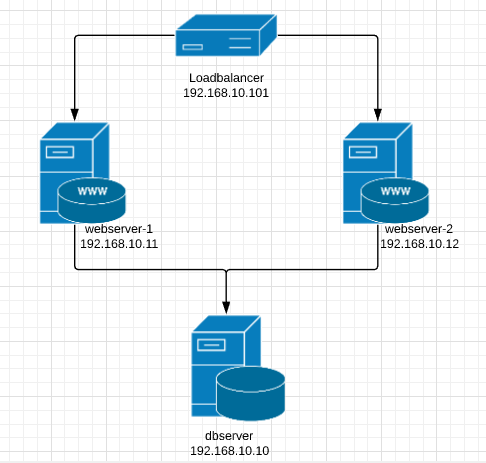
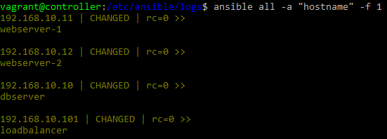

# Annexos

L'estructura que utilitzarem per fer les nostres amb Ansible serà la següent:

Aquesta estructura la farem possible gràcies a l'eina de Vagrant i Ansible.

## Instal·lació en Linux.
Per començar tenim que instal·lar el software de Ansible, per portar-ho a terme llançaren les següents comandes:

`$ sudo apt-add-repository ppa:ansible/ansible`

`$ sudo apt-get Update`

`$ sudo apt-get install ansible`

Al llençar la comanda “sudo apt-get install ansible” ens donarà un error amb el Ubuntu 18.04 per tractar de solventar-ho tenim que llençar la comanda següent

`$ sudo add-apt-repository universe`

## Configuració de les nostres màquines mitjançant VAGRANT

En el meu cas per a poder gestionar de forma molt més senzilla i ràpida totes les màquines virtuals he fet us de l’eina anomenada Vagrant, ja que no només em deixa la possibilitat de poder instal·lar cuántes màquines vulgui si no que puc implementar l’Ansible de forma més sencilla i ràpida, a més de poder aprofitar el codi per llençar els nodes que implementaré després.

Per començar, en aquest apartat podem veure el fitxer empleat per la configuració de la nostra maquina principal Ansible, podem observar que utilitzen una versió de Ubuntu 16.04, amb una xarxa privada amb l’IP 192.168.10.100, una carpeta compartida Shared que s’ubicarà en l’arrel de el nostre Vagrantfile, memòria ram i CPU. 

__Fitxer d'instalació del servidor amb Ansible__

Si observen el fitxer veurem que hi ha una configuració amb el path “config.sh” això ho utilitzarem per instal·lar el Ansible de forma automàtica a la nostra màquina virtual.

I iniciem el nostre servidor controlador que serà l’encarregat de gestionar els altres nodes, carreguem la configuració del fitxer amb la comanda `vagrant up`.

Ara per veure si la nostra màquina s’ha configurat correctament fem un SSH cap a l’IP del nostre servidor.

__Fitxer d'instalació dels servidors nodes__

En aquest fitxer veurem la configuració del Loadbalancer, els dos servidors web i el de BBDD.

## Habilitació del SSH i contrasenya per la correcta gestió de Ansible

Un dels problemes que té l’administració remota es la continua petició de les credencials alhora d’introduir una comanda de Ansible, aquesta tasca pot ser molt feixuga si tenim molts nodes no volem que sempre ens demani la contrasenya, així que per obviar-lo haurem d’ **habilitar** per el nostre node principal **l' autorització i copia de la contrasenya root** dels altres servidores cap al servidor principal Ansible, d’aquesta forma farem que Ansible pugui accedir de forma correcta:

Primer de tot autoritzarem l’autorització per ssh del usuari root per els nostres nodes dintre del fitxer `/etc/ssh/sshd_config`, canviarem el prohibit password per **yes** `permitrootlogin YES`:

Per últim reiniciem el servei i amb això ja ens podriem logear amb l'usuari root.

`$ sudo service ssh restart`

Un cop habilitat el SSH per root a els nostres nodes, tenim que activar i modificar la contrasenya dels nostres hosts que penjaram del servidor principal.

Per tal de poder obtenir les mateixes credencials de root en tots els nodes utilitzarem la següent comanda en el **controlador** que ens crearà una nova clau:

`$$ ssh-keygen –t rsa` (Aquesta comanda el que fa es generar unes claus per el ssh-copy-id)

Ara afegirem la contrasenya root dels nostres nodes dintre del nostre host-controlador Ansible:

`$vagrant@cotroler: ssh-copy-id root@192.168.10.101` #Ip del sevidor de càrrega (Loadbalancer)

També cal tenir present que no sempre realitzarem tasques com a root de forma que també copiarem la contrasenya del usuari, en aquest cas serà el de Vagrant.

`$vagrant@cotroler: ssh-copy-id vagrant@192.168.10.101` << Aquesta comanda s'ha d'emprà a tots els nodes per evitar problemes de connexió  amb les comandes de Ansible.

## Primeres comandes bàsiques de Ansible (Comandes AD-HOC)

Ansible té la gran facilitat de deixar de banda les tasques antigues con per exemple tenir que entrar per SSH a cadascun dels nostres servidors descarregar el WordPress, Apache o qualsevol altre servici e instal·lar-ho de forma seqüencial un per un, amb unes sencilles comandes podem realitzar un manteniment e instal·lació dels nostres serveis de forma paral·lela i conjunta de tots els nostres nodes de forma segura i evitant així problemes d’ incongruència.

Abans de fer qualsevol tasca relacionada amb Ansible tenim que comprovar que els nostres nodes **es troben sincronitzats per data i hora** a més **comprovarem que tenim els recursos suficients per executar una aplicació.**, això es coneix con comandes *AD-HOC*.

* Comprovació del hostname de tots els nodes de forma paralela amb Ansible:
  * `$ansible all -a "hostname"` --> Aquesta comanda té com a funció dir-nos els hostname de totes les màquines que es troven controlades per Ansible, aquesta comanda equival a `$ansible 192.168.10.101,192.168.10.10,192.168.10.11,192.168.10.12 -a "hostname"`.

  

Per defecte, Ansible executa les comandes de forma paral·lela per acabar abans, si tenim dos servidors com es el cas, no notarem la diferente però si afegim més servidors comprovare que funciona més ràpid si paral·lelitzem.

* Per comprovar la execució de comades de forma sequencial utilitzarem el paràmetre "-f 1".
  * `$ansible all -a "hostname" -f 1` (Aquest paràmetre només s'utilitza quan tinguem molts servidors i el nostre ample de banda no sigui molt bo, per això es recomana que per les xarxes més lentes utilitzin aquest paràmetre.

  

* També podem observar l'espai dels nostres servidors com si fos una comanda cap al nostre servidor local.
  * `$ansible all -a "df -h"`

  

* Comprovació de la nostra memòria cau per poder comprovar que tenim espai suficient per poder instalar un WordPress o Apache.
  * `$ansible all -a "free -m"`
 
### FACTS

Els facts son els detalls de un servidor o grup de servidors, aquesta comanda ens permet obtenir una llista exhaustiva dels detalls del nostres nodes.

Per exemple en les següents captures podem veure les IPs del nostre servidor, la data y hora amb segons, el mes, el SO, la Home, entre altres caràcteristiques.

  

