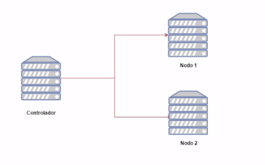
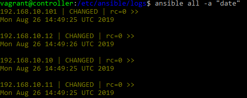

# Desenvolupament del projecte

1. [Objectiu](#objectiu)<br>
2. [Vagrant](#vagrant)<br>
3. [Creació de rols i configuració de màquina](#conf)<br>
4. [Webserver i configuració Apache](#apachephp)<br>
5. [Instalació i configuració de MySQL](#confmysql)<br>
6. [Instalació i configuració de un WordPress](#wordpress)<br>


<a name="objectiu"></a>
## 1. Objectiu

L' objectiu del nostre projecte es poder aprendre sobre aquesta eina d'orquestació anomenada Ansible que es troba molt demandada a causa de la seva potència i la seva facilitat en la gestió i configuració de servidors. Amb aquest software replicarem una estructura web i per fer-ho cal assolir els següents objectius:

- L'implementació d' un servidor de carrega.
- L'instal·lació de dos servidos web amb PHP i Apache per implementar un WordPress.
- Instal·lar un servidor de base de dades.

L'arquitectura que volem contruir serà la següent:



Per poder desenvolupar el nostre projecte farem ús de Vagrant per crear el nostre entorn de desenvolupament.

<a name="vagrant"></a>
## 2. Vagrant

Per començar a desenvolupar aquest projecte orientat a la pràctica he utilitzat un recurs molt innovador per crear, modificar i gestionar les meves màquines virtuals a partir de Virtual-Box, això ho he fet amb [Vagrant](https://www.conasa.es/blog/vagrant-la-herramienta-para-crear-entornos-de-desarrollo-reproducibles/).


Per fer-ho primerament he hagut de crear en una zona de proves amb 1 controlador, 1 servidor de carrega, 2 nodes webserver i 1 per fer l'implementació de la BBDD a partir del [fitxer de configuració](/annexos/#controllernode).

<a name="conf"></a>
## 3. Creació de rols i configuració de màquina

Un cop hem pogut comprovar que les màquines han sigut creades segons els nostres fitxers *Vagrantfile* he tingut que [habilitar el SSH i l'autorització del usuari root](/annexos/#ssh-passwd) de forma remota per poder connectarnos amb Ansible amb el mateix ID a tots els nostres servidors.

Havent acabat la configuració prèvia de nostres maquines podem procedir a entrar dins del nostre entorn Ansible, no sense abans comprovar la correcta sincronització de data i hora i la disponibilitat dels nostres recursos, podem trobar més informació sobre les comandes bàsiques [AD-HOC](/annexos/#comandasbasicas).



Aquesta comprovació de data i hora la fem perquè encara que algunes aplicacions tolerim una petita diferencia horaria si es sobrepasa el límit podem tenir problemes d'incongruencies entre els nostres nodes, la forma més sencilla es utilitzan el NTP *Network Time Protocol*.

__Hosts del proyecte__

Dintre del fitxer `hosts` que serà el nostre [inventari](/Introduccio/#hostsigrups) per defecte he afegit els meus servidors perquè Ansible els pugui controlar, juntament amb les seves variables de usuari, hosts, i grups.

Fitxer `/etc/ansible/hosts`

hosts.png

__Estructura del nostre sistema de fitxers__

estructurafinal.png

__Instal·lació del nostre balancejador de càrrega__

Per fer-ho he tingut que crear un rol anomenat `haproxy` on he posat el següent codi per instal·lar el HAProxy en el nostre servidor.

- Fitxer de configuració `loadbalancers.yml`:

```
---
- name: Servidor de càrrega (LoadBalancer)
  hosts: loadbalancers
  roles:
    - role: haproxy
...
```

loadbalancer1.png

[Més informació sobre l'instal·lació d'HAProxy.](../annexos/#loadbalancer)

Un cop tenim el HAProxy configurat només tenim que anar a la següent url per veure el panell de administració.

http://192.168.10.101/haproxy?stats

loadbalancer2.png

Com podem veure els nostres dos serveis web es troben _DOWN_ això es perquè encara no tenim cap servidor web configurat.

<a name="apachephp"></a>
## 4. PHP i configuració dels servidors web__

Semblant a l'instal·lació del servidor de càrrega he creat un rol amb el nom de `apache` per poder configurar i administrar els nostres dos servidors de Apache.

- Fitxer de administració i instal·lació del rol Apache i PHP `webservers.yml`:

```
---
- name: Servidors web amb Apache
  hosts: webservers
  roles:
    - role: apache
    - role: php
...
```

webservers1.png

Comproven que càrrega els nostres llocs amb la pàgina per defecte de Apache:

webservers2.png

webservers3.png

Instal·lació de totes les tasques per poder configurar el nostre Apache:

webservers4.png

[Més informació sobre la configuració i instal·lació del nostres servidors Apache.](../annexos/#webserversapache)

Instal·lació del rol de PHP en el nostre servidor:

php1.png

[Configuració dels fitxers d'instal·lació de PHP.](../annexos/#php)

<a name="confmysql"></a>
## 5. Instal·lació i configuració de MySQL__

Per crear la nostra infraestructura amb WordPress es necessari tenir una base de dades instal·lada al notre servidor `192.168.10.10`.

* Utilitzarem el següent codi per poder instal·lar el nostre rol de **mysql**:

```
---

- name: Servidor Base de dades
  hosts: bdserver
  roles:
    -role: mysql
...
```

bbdd1.png

Un cop hem comprobat que la base de dades s'ha creat correctament, procedirem a actualitzar el fitxer mysqld.conf, juntament amb el my.cnf, actualitzar la contrasenya `root` per la nostra BBDD, crear la nova base de dades per el WordPress i l'usuari per defecte.

bbdd2.png

[Condifuració de les tasques del Playbook per la BBDD](../annexos/#mysql)

<a name="wordpress"></a>
## 6. Instal·lació i configuració de WordPress

Per instal·lar el WordPress vaig tenir que descarregar-ho del [repositori oficial](https://es.wordpress.org/download/) de WordPress i implementar-ho en els dos servidors web amb Apache que ja tenim. 

* Fitxer de configuració de les **tasques** a fer per Ansible per WordPress.

```
---

- name: Instal·lar packet unzip
  apt: name=unzip state=installed

- name: Comprovar si WordPress es troba instal·lat
  stat: path="{{ wp_download_path }}"
  register: wp_zipped

- name: Descargar WordPress
  get_url: url="{{ wp_url }}" dest="{{ wp_download_path }}"
  when: wp_zipped.stat.exists == False

- name: Unzip WordPress
  unarchive: src="{{ wp_download_path }}" dest="{{ wp_webserver_path }}" copy=no

- name: Copiar fitxer wp-config.php cap al webserver
  template:
    src: wp-config.php.j2
    dest: "{{ wp_webserver_path }}/wp-config.php"

...

```

* Fitxer de **les variables per defecte**:

```
---
#En el nostre cas la configuració a fer la farem amb la versió 5.2.2 de WordPress

wp_url: "https://es.wordpress.org/latest-es_ES.zip"

#directori on deixarem el .zip
wp_download_path: "/tmp/wordpress-5.2.2.zip"

#Descomprimir el fitxer
wp_webserver_path: "/var/www"
```

* Fitxer de configuració de la **nostra plantilla** `wp-config.php.j2`:

```

<?php
/**
 * The base configuration for WordPress
 *
 * The wp-config.php creation script uses this file during the
 * installation. You don't have to use the web site, you can
 * copy this file to "wp-config.php" and fill in the values.
 *
 * This file contains the following configurations:
 *
 * * MySQL settings
 * * Secret keys
 * * Database table prefix
 * * ABSPATH
 *
 * @link https://codex.wordpress.org/Editing_wp-config.php
 *
 * @package WordPress
 */

// ** MySQL settings - You can get this info from your web host ** //
/** The name of the database for WordPress */
define( 'DB_NAME', 'database_name_here' );

/** MySQL database username */
define( 'DB_USER', 'username_here' );

/** MySQL database password */
define( 'DB_PASSWORD', 'password_here' );

/** MySQL hostname */
define( 'DB_HOST', 'localhost' );

/** Database Charset to use in creating database tables. */
define( 'DB_CHARSET', 'utf8' );

/** The Database Collate type. Don't change this if in doubt. */
define( 'DB_COLLATE', '' );

/**#@+
 * Authentication Unique Keys and Salts.
 *
 * Change these to different unique phrases!
 * You can generate these using the {@link https://api.wordpress.org/secret-key/1.1/salt/ WordPress.org secret-key service}
 * You can change these at any point in time to invalidate all existing cookies. This will force all users to have to log in again.
 *
 * @since 2.6.0
 */
define( 'AUTH_KEY',         'put your unique phrase here' );
define( 'SECURE_AUTH_KEY',  'put your unique phrase here' );
define( 'LOGGED_IN_KEY',    'put your unique phrase here' );
define( 'NONCE_KEY',        'put your unique phrase here' );
define( 'AUTH_SALT',        'put your unique phrase here' );
define( 'SECURE_AUTH_SALT', 'put your unique phrase here' );
define( 'LOGGED_IN_SALT',   'put your unique phrase here' );
define( 'NONCE_SALT',       'put your unique phrase here' );

/**#@-*/

/**
 * WordPress Database Table prefix.
 *
 * You can have multiple installations in one database if you give each
 * a unique prefix. Only numbers, letters, and underscores please!
 */
$table_prefix = 'wp_';

/**
 * For developers: WordPress debugging mode.
 *
 * Change this to true to enable the display of notices during development.
 * It is strongly recommended that plugin and theme developers use WP_DEBUG
 * in their development environments.
 *
 * For information on other constants that can be used for debugging,
 * visit the Codex.
 *
 * @link https://codex.wordpress.org/Debugging_in_WordPress
 */
define( 'WP_DEBUG', false );

/* That's all, stop editing! Happy publishing. */

/** Absolute path to the WordPress directory. */
if ( ! defined( 'ABSPATH' ) ) {
        define( 'ABSPATH', dirname( __FILE__ ) . '/' );
}

/** Sets up WordPress vars and included files. */
require_once( ABSPATH . 'wp-settings.php' );
vagrant@webserver-1:~$ exit
logout
Connection to 192.168.10.11 closed.
vagrant@controller:/etc/ansible/group_vars$ cd ..
vagrant@controller:/etc/ansible$ cd
ansible.cfg        group_vars/        hosts_vars/        logs/              webservers.yml
bbddservers.yml    hosts              loadbalancers.yml  roles/
vagrant@controller:/etc/ansible$ cd roles/wordpress/templates/
vagrant@controller:/etc/ansible/roles/wordpress/templates$ sudo nano ma
vagrant@controller:/etc/ansible/roles/wordpress/templates$ sudo nano main.yml
vagrant@controller:/etc/ansible/roles/wordpress/templates$
vagrant@controller:/etc/ansible/roles/wordpress/templates$ sudo nano wp-config.php
vagrant@controller:/etc/ansible/roles/wordpress/templates$ sudo nano wp-config.php
vagrant@controller:/etc/ansible/roles/wordpress/templates$ sudo mv wp-config.php wp-config.php.j2
vagrant@controller:/etc/ansible/roles/wordpress/templates$ cat ../.
./  ../
vagrant@controller:/etc/ansible/roles/wordpress/templates$ cat ../../
apache/    haproxy/   mysql/     php/       wordpress/
vagrant@controller:/etc/ansible/roles/wordpress/templates$ cat ../../mysql/defaults/main.yml
#Configuració amb Ubuntu 16.04
mysql_packages:
  - mysql-server
  - python-mysqldb
  - python-selinux


#Directori per defecte MySQL
mysql_conf_dir: "/etc/mysql"

#Port per defecte
mysql_port: 3306

#Adreça per defecte per poder accedir als nostres hosts
mysql_bind_address: "0.0.0.0"

#Variable de usuari root
mysql_root_pass: root

#Nom de les nostres bbdd
mysql_db:
  - name: wpazambrano

#Usuari WordPress
mysql_users:
  - name: wpariel
    password: P@ssw0rd
    priv: "*.*:ALL"
vagrant@controller:/etc/ansible/roles/wordpress/templates$ cd ..
vagrant@controller:/etc/ansible/roles/wordpress$ cd ..
vagrant@controller:/etc/ansible/roles$ cd ..
vagrant@controller:/etc/ansible$ cd group_vars/
vagrant@controller:/etc/ansible/group_vars$ sudo nano all.yml
vagrant@controller:/etc/ansible/group_vars$ sudo nano all.yml
vagrant@controller:/etc/ansible/group_vars$ cd ..
vagrant@controller:/etc/ansible$ cd roles/mysql/defaults/
vagrant@controller:/etc/ansible/roles/mysql/defaults$ sudo nano main.yml
vagrant@controller:/etc/ansible/roles/mysql/defaults$ cd ..
vagrant@controller:/etc/ansible/roles/mysql$ cd ..
vagrant@controller:/etc/ansible/roles$ cd wordpress/
defaults/  tasks/     templates/
vagrant@controller:/etc/ansible/roles$ cd wordpress/templates/
vagrant@controller:/etc/ansible/roles/wordpress/templates$ ls
wp-config.php.j2
vagrant@controller:/etc/ansible/roles/wordpress/templates$ sudo nano wp-config.php.j2
vagrant@controller:/etc/ansible/roles/wordpress/templates$ cat ../../
apache/    haproxy/   mysql/     php/       wordpress/
vagrant@controller:/etc/ansible/roles/wordpress/templates$ cat ../../../
ansible.cfg        group_vars/        hosts_vars/        logs/              webservers.yml
bbddservers.yml    hosts              loadbalancers.yml  roles/
vagrant@controller:/etc/ansible/roles/wordpress/templates$ cat ../../../group_vars/all.yml
---
#Nom de les nostres bbdd
mysqldb: "wpazambrano"

#Usuari WordPress
userdb: "wpariel"
passworddb: "P@ssw0rd"
...
vagrant@controller:/etc/ansible/roles/wordpress/templates$ sudo nano wp-config.php.j2
vagrant@controller:/etc/ansible/roles/wordpress/templates$ sudo nano wp-config.php.j2
vagrant@controller:/etc/ansible/roles/wordpress/templates$ cd ..
vagrant@controller:/etc/ansible/roles/wordpress$ cd ..
vagrant@controller:/etc/ansible/roles$ cd ..
vagrant@controller:/etc/ansible$ cd group_vars/
vagrant@controller:/etc/ansible/group_vars$ sudo nano all.yml
vagrant@controller:/etc/ansible/group_vars$ cd ..
vagrant@controller:/etc/ansible$ ls
ansible.cfg  bbddservers.yml  group_vars  hosts  hosts_vars  loadbalancers.yml  logs  roles  webservers.yml
vagrant@controller:/etc/ansible$ cd roles/wordpress/tasks/
vagrant@controller:/etc/ansible/roles/wordpress/tasks$ sudo nano main.yml
vagrant@controller:/etc/ansible/roles/wordpress/tasks$ cd ..
vagrant@controller:/etc/ansible/roles/wordpress$ cd ..
vagrant@controller:/etc/ansible/roles$ cd ..
vagrant@controller:/etc/ansible$ ansible-playbook webservers.yml

PLAY [Servidors web amb Apache] ********************************************************************************************************************************

TASK [Gathering Facts] *****************************************************************************************************************************************
ok: [webserver-one]
ok: [webserver-two]

TASK [apache : Asegurar que l'Apache es troba instal·lat] ******************************************************************************************************
ok: [webserver-two] => (item=[u'apache2', u'apache2-utils'])
ok: [webserver-one] => (item=[u'apache2', u'apache2-utils'])

TASK [apache : Habilitar modul] ********************************************************************************************************************************
ok: [webserver-one] => (item=rewrite.load)
ok: [webserver-two] => (item=rewrite.load)

TASK [apache : Add virtual hosts configuration] ****************************************************************************************************************
ok: [webserver-two]
ok: [webserver-one]

TASK [apache : Add enabled virtuals hosts] *********************************************************************************************************************
ok: [webserver-one]
ok: [webserver-two]

TASK [apache : Remove default virtual hosts in sites-enabled] **************************************************************************************************
ok: [webserver-one]
ok: [webserver-two]

TASK [php : Install PHP packages] ******************************************************************************************************************************
ok: [webserver-two] => (item=[u'php7.0', u'libapache2-mod-php7.0', u'php7.0-mysql', u'php7.0-curl'])
ok: [webserver-one] => (item=[u'php7.0', u'libapache2-mod-php7.0', u'php7.0-mysql', u'php7.0-curl'])

TASK [wordpress : Instal·lar packet unzip] *********************************************************************************************************************
ok: [webserver-two]
ok: [webserver-one]

TASK [wordpress : Comprovar si WordPress es troba instal·lat] **************************************************************************************************
ok: [webserver-one]
ok: [webserver-two]

TASK [wordpress : Descargar WordPress] *************************************************************************************************************************
skipping: [webserver-one]
skipping: [webserver-two]

TASK [wordpress : Unzip WordPress] *****************************************************************************************************************************
changed: [webserver-two]
changed: [webserver-one]

TASK [wordpress : Copiar fitxer wp-config.php cap al webserver] ************************************************************************************************
changed: [webserver-two]
changed: [webserver-one]

PLAY RECAP *****************************************************************************************************************************************************
webserver-one              : ok=11   changed=2    unreachable=0    failed=0    skipped=1    rescued=0    ignored=0
webserver-two              : ok=11   changed=2    unreachable=0    failed=0    skipped=1    rescued=0    ignored=0

vagrant@controller:/etc/ansible$ cd roles/wordpress/
vagrant@controller:/etc/ansible/roles/wordpress$ ls
defaults  tasks  templates
vagrant@controller:/etc/ansible/roles/wordpress$ cd tasks/
vagrant@controller:/etc/ansible/roles/wordpress/tasks$ cat main.yml
---

- name: Instal·lar packet unzip
  apt: name=unzip state=installed

- name: Comprovar si WordPress es troba instal·lat
  stat: path="{{ wp_download_path }}"
  register: wp_zipped

- name: Descargar WordPress
  get_url: url="{{ wp_url }}" dest="{{ wp_download_path }}"
  when: wp_zipped.stat.exists == False

- name: Unzip WordPress
  unarchive: src="{{ wp_download_path }}" dest="{{ wp_webserver_path }}" copy=no

- name: Copiar fitxer wp-config.php cap al webserver
  template:
    src: wp-config.php.j2
    dest: "{{ wp_webserver_path }}/wp-config.php"

...
vagrant@controller:/etc/ansible/roles/wordpress/tasks$ cd ..
vagrant@controller:/etc/ansible/roles/wordpress$ cat defaults/main.yml
---
#En el nostre cas la configuració a fer la farem amb la versió 5.2.2 de WordPress

wp_url: "https://es.wordpress.org/latest-es_ES.zip"

#directori on deixarem el .zip
wp_download_path: "/tmp/wordpress-5.2.2.zip"

#Descomprimir el fitxer
wp_webserver_path: "/var/www"
vagrant@controller:/etc/ansible/roles/wordpress$ ls
defaults  tasks  templates
vagrant@controller:/etc/ansible/roles/wordpress$ cat templates/wp-config.php.j2
<?php
/**
 * The base configuration for WordPress
 *
 * The wp-config.php creation script uses this file during the
 * installation. You don't have to use the web site, you can
 * copy this file to "wp-config.php" and fill in the values.
 *
 * This file contains the following configurations:
 *
 * * MySQL settings
 * * Secret keys
 * * Database table prefix
 * * ABSPATH
 *
 * @link https://codex.wordpress.org/Editing_wp-config.php
 *
 * @package WordPress
 */

// ** MySQL settings - You can get this info from your web host ** //
/** The name of the database for WordPress */
define( 'DB_NAME', '{{ mysqldb }}' );

/** MySQL database username */
define( 'DB_USER', '{{ userdb }}' );

/** MySQL database password */
define( 'DB_PASSWORD', '{{ passworddb }}' );

/** MySQL hostname */
define( 'DB_HOST', '{{ hostdb }}' );

/** Database Charset to use in creating database tables. */
define( 'DB_CHARSET', 'utf8' );

/** The Database Collate type. Don't change this if in doubt. */
define( 'DB_COLLATE', '' );

/**#@+
 * Authentication Unique Keys and Salts.
 *
 * Change these to different unique phrases!
 * You can generate these using the {@link https://api.wordpress.org/secret-key/1.1/salt/ WordPress.org secret-key service}
 * You can change these at any point in time to invalidate all existing cookies. This will force all users to have to log in again.
 *
 * @since 2.6.0
 */
define( 'AUTH_KEY',         'put your unique phrase here' );
define( 'SECURE_AUTH_KEY',  'put your unique phrase here' );
define( 'LOGGED_IN_KEY',    'put your unique phrase here' );
define( 'NONCE_KEY',        'put your unique phrase here' );
define( 'AUTH_SALT',        'put your unique phrase here' );
define( 'SECURE_AUTH_SALT', 'put your unique phrase here' );
define( 'LOGGED_IN_SALT',   'put your unique phrase here' );
define( 'NONCE_SALT',       'put your unique phrase here' );

/**#@-*/

/**
 * WordPress Database Table prefix.
 *
 * You can have multiple installations in one database if you give each
 * a unique prefix. Only numbers, letters, and underscores please!
 */
$table_prefix = 'wp_';

/**
 * For developers: WordPress debugging mode.
 *
 * Change this to true to enable the display of notices during development.
 * It is strongly recommended that plugin and theme developers use WP_DEBUG
 * in their development environments.
 *
 * For information on other constants that can be used for debugging,
 * visit the Codex.
 *
 * @link https://codex.wordpress.org/Debugging_in_WordPress
 */
define( 'WP_DEBUG', false );

/* That's all, stop editing! Happy publishing. */

/** Absolute path to the WordPress directory. */
if ( ! defined( 'ABSPATH' ) ) {
        define( 'ABSPATH', dirname( __FILE__ ) . '/' );
}

/** Sets up WordPress vars and included files. */
require_once( ABSPATH . 'wp-settings.php' );
```

