# Desenvolupament del projecte

1. [Objectiu](#objectiu)<br>
2. [Vagrant](#vagrant)<br>
3. [Creació de rols i configuració de màquina](#conf)<br>
4. [Webserver i configuració Apache](#apachephp)<br>
5. [Instalació i configuració de MySQL](#confmysql)<br>
6. [Instalació i configuració de un WordPress](#wordpress)<br>


<a name="objectiu"></a>
## 1. Objectiu

L' objectiu del nostre projecte es poder aprendre sobre aquesta eina d'orquestació anomenada Ansible que es troba molt demandada a causa de la seva potència i la seva facilitat en la gestió i configuració de servidors. Amb aquest software replicarem una estructura web i per fer-ho cal assolir els següents objectius:

- L'implementació d' un servidor de carrega.
- L'instal·lació de dos servidos web amb PHP i Apache per implementar un WordPress.
- Instal·lar un servidor de base de dades.

L'arquitectura que volem contruir serà la següent:


Per poder desenvolupar el nostre projecte farem ús de Vagrant per crear el nostre entorn de desenvolupament.

<a name="vagrant"></a>
## 2. Vagrant

Per començar a desenvolupar aquest projecte orientat a la pràctica he utilitzat un recurs molt innovador per crear, modificar i gestionar les meves màquines virtuals a partir de Virtual-Box, això ho he fet amb [Vagrant](https://www.conasa.es/blog/vagrant-la-herramienta-para-crear-entornos-de-desarrollo-reproducibles/).


Per fer-ho primerament he hagut de crear en una zona de proves amb 1 controlador, 1 servidor de carrega, 2 nodes webserver i 1 per fer l'implementació de la BBDD a partir del [fitxer de configuració](/annexos/#controllernode).

<a name="conf"></a>
## 3. Creació de rols i configuració de màquina

Un cop hem pogut comprovar que les màquines han sigut creades segons els nostres fitxers *Vagrantfile* he tingut que [habilitar el SSH i l'autorització del usuari root](/annexos/#ssh-passwd) de forma remota per poder connectarnos amb Ansible amb el mateix ID a tots els nostres servidors.

Havent acabat la configuració prèvia de nostres maquines podem procedir a entrar dins del nostre entorn Ansible, no sense abans comprovar la correcta sincronització de data i hora i la disponibilitat dels nostres recursos, podem trobar més informació sobre les comandes bàsiques [AD-HOC](/annexos/#comandasbasicas).


Aquesta comprovació de data i hora la fem perquè encara que algunes aplicacions tolerim una petita diferencia horaria si es sobrepasa el límit podem tenir problemes d'incongruencies entre els nostres nodes, la forma més sencilla es utilitzan el NTP *Network Time Protocol*.

__Hosts del proyecte__

Dintre del fitxer `hosts` que serà el nostre [inventari](/Introduccio/#hostsigrups) per defecte he afegit els meus servidors perquè Ansible els pugui controlar, juntament amb les seves variables de usuari, hosts, i grups.

Fitxer `/etc/ansible/hosts`

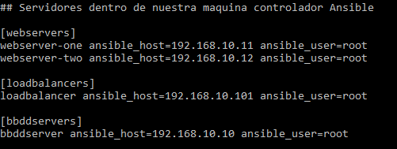

__Estructura del nostre sistema de fitxers__

```
.
├── ansible.cfg                   ### Fitxer de configuració de Ansible.
├── bbddservers.yml
├── group_vars                    ### Variables en cojunt que compartiram els servidors, com per exemple els dos webservers.
│   ├── all.yml
│   ├── bbddservers.yml
│   ├── loadbalancers.yml
│   └── webservers.yml
├── hosts                         ### Inventari de Ansible amb els nostrs hosts.
├── hosts_vars                    ### Variables individuals dels nostres servidors.
│   ├── bbddserver.yml
│   ├── loadbalancer.yml
│   ├── webserver-one.yml
│   └── webserver-two.yml
├── loadbalancers.yml
├── logs
│   └── ansible.log
├── roles                         ### Configuració de totes els nostres rols amb les seves carpetes que actuaram com a tasques.
│   ├── apache                    ### Rol de apache
│   │   ├── defaults
│   │   │   └── main.yml
│   │   ├── handlers
│   │   │   └── main.yml
│   │   ├── tasks
│   │   │   └── main.yml
│   │   └── templates
│   │       └── vhosts.conf.j2
│   ├── haproxy                   ### Rol de HAProxy
│   │   ├── defaults
│   │   │   └── main.yml
│   │   ├── handlers
│   │   │   └── main.yml
│   │   ├── tasks
│   │   │   └── main.yml
│   │   └── templates
│   │       └── haproxy.cfg.j2
│   ├── mysql                     ### Rol MySQL
│   │   ├── defaults
│   │   │   └── main.yml
│   │   ├── handlers
│   │   │   └── main.yml
│   │   ├── tasks
│   │   │   └── main.yml
│   │   └── templates
│   │       └── mysqld.conf.j2
│   ├── php                       ### Rol PHP
│   │   ├── defaults
│   │   │   └── main.yml
│   │   └── tasks
│   │       └── main.yml
│   └── wordpress                 ### Rol de WordPress
│       ├── defaults
│       │   └── main.yml
│       ├── tasks
│       │   └── main.yml
│       └── templates
│           └── wp-config.php.j2
└── webservers.yml
```

__Instal·lació del nostre balancejador de càrrega__

Per fer-ho he tingut que crear un rol anomenat `haproxy` on he posat el següent codi per instal·lar el HAProxy en el nostre servidor.

- Fitxer de configuració `loadbalancers.yml`:

```
---
- name: Servidor de càrrega (LoadBalancer)
  hosts: loadbalancers
  roles:
    - role: haproxy
...
```

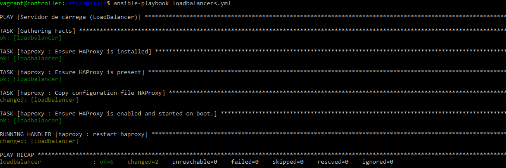

[Més informació sobre l'instal·lació d'HAProxy.](../annexos/#loadbalancer)

Un cop tenim el HAProxy configurat només tenim que anar a la següent url per veure el panell de administració.

http://192.168.10.101/haproxy?stats

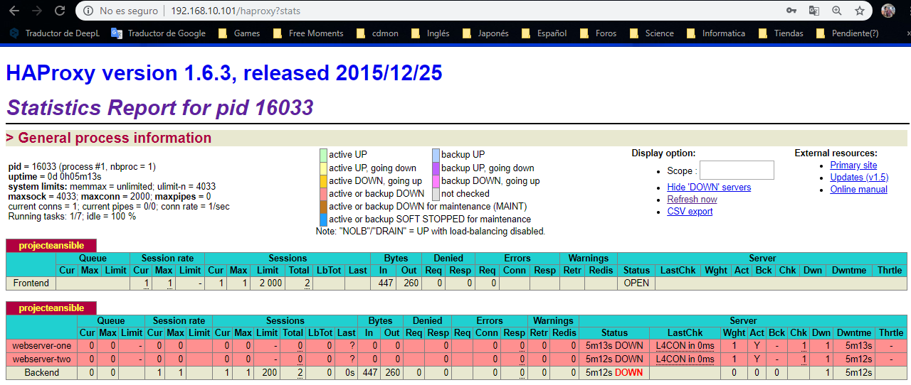

Com podem veure els nostres dos serveis web es troben _DOWN_ això es perquè encara no tenim cap servidor web configurat.

<a name="apachephp"></a>
## 4. PHP i configuració dels servidors web__

Semblant a l'instal·lació del servidor de càrrega he creat un rol amb el nom de `apache` per poder configurar i administrar els nostres dos servidors de Apache.

- Fitxer de administració i instal·lació del rol Apache i PHP `webservers.yml`:

```
---
- name: Servidors web amb Apache
  hosts: webservers
  roles:
    - role: apache
    - role: php
...
```

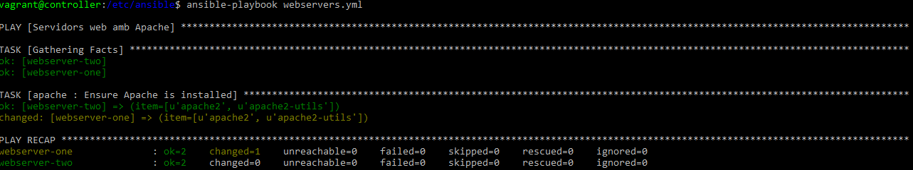

Comproven que càrrega els nostres llocs amb la pàgina per defecte de Apache:

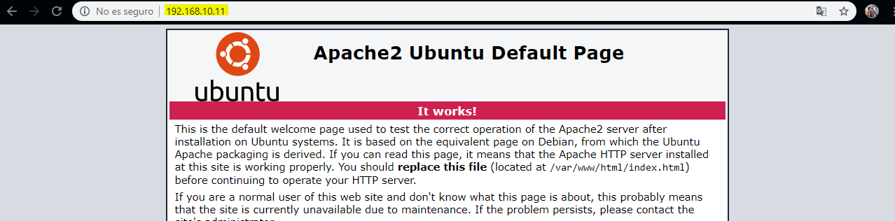

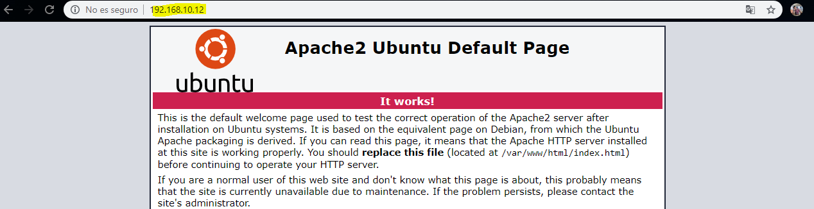

Instal·lació de totes les tasques per poder configurar el nostre Apache:

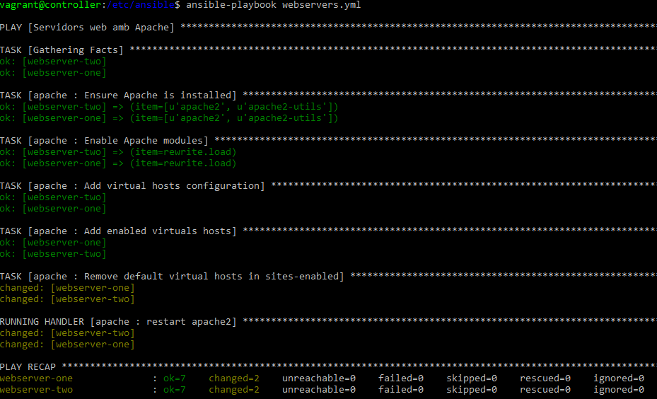

[Més informació sobre la configuració i instal·lació del nostres servidors Apache.](../annexos/#webserversapache)

Instal·lació del rol de PHP en el nostre servidor:

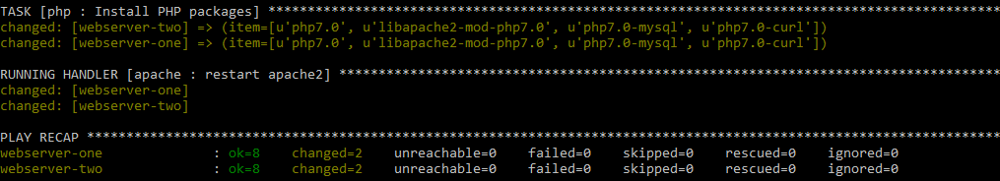

[Configuració dels fitxers d'instal·lació de PHP.](../annexos/#php)

<a name="confmysql"></a>
## 5. Instal·lació i configuració de MySQL__

Per crear la nostra infraestructura amb WordPress es necessari tenir una base de dades instal·lada al notre servidor `192.168.10.10`.

* Utilitzarem el següent codi per poder instal·lar el nostre rol de **mysql**:

```
---

- name: Servidor Base de dades
  hosts: bdserver
  roles:
    -role: mysql
...
```

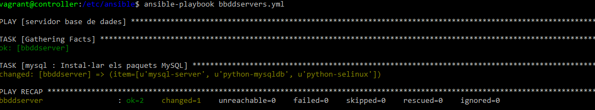

Un cop hem comprobat que la base de dades s'ha creat correctament, procedirem a actualitzar el fitxer mysqld.conf, juntament amb el my.cnf, actualitzar la contrasenya `root` per la nostra BBDD, crear la nova base de dades per el WordPress i l'usuari per defecte.

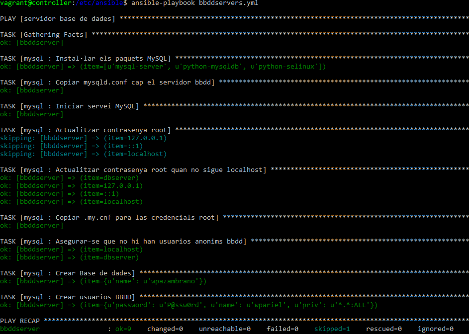

[Condifuració de les tasques del Playbook per la BBDD](../annexos/#mysql)

## 6. Instal·lació i configuració de WordPress

Per instal·lar el WordPress vaig tenir que descarregar-ho del [repositori oficial](https://es.wordpress.org/download/) de WordPress i implementar-ho en els dos servidors web amb Apache que ja tenim. 

Com a últim punt, per instal·lar i configurar el nostre WordPress i configurar els paràmetres necessaris només he tingut que crear el rol i afegir-lo dintre del fitxer `webservers.yml`:

```
---
- name: Servidors web amb Apache
  hosts: webservers
  roles:
    - role: apache
    - role: php
    - role: wordpress <<<<
...
```
Aquest rol ho he desenvolupat amb les seves tasques, variables per defecte, i plantilla.

En la configuració podem observar les tasques a realitzar, com instal·lar el paquet Unzip que no ve en Ubuntu 16.04 per defecte, la comprobació si el WordPress ja es troba instal·lat, descarregar-ho i copiar el nostre fitxer Jina2 `wp-config.php.j2` cap als nostres servidors web per aplicar-hi les configuracions a nivell de usuario, password, i bbdd.

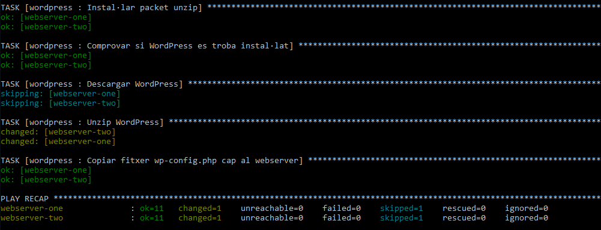

[Configuració de WordPress.](/annexos/#wordpress)

Un cop finalitzat l'instalació del nostre lloc amb WordPress només cal accedir cap a qualsevol de les nostres IPs **192.168.10.11, 192.168.10.12**:

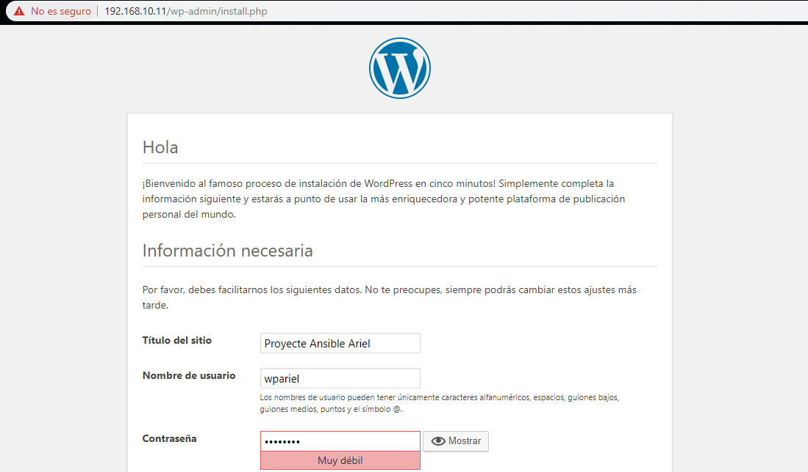

Configurar el nom del nostre lloc amb el nom que volguem i ja poden administrar el nostre lloc creat amb el CMS WordPress.

I amb aquest procès ja tindrem el WordPress instal·lat i llest, amb una base de dades, un servidor de càrrega, i dos servidors web.

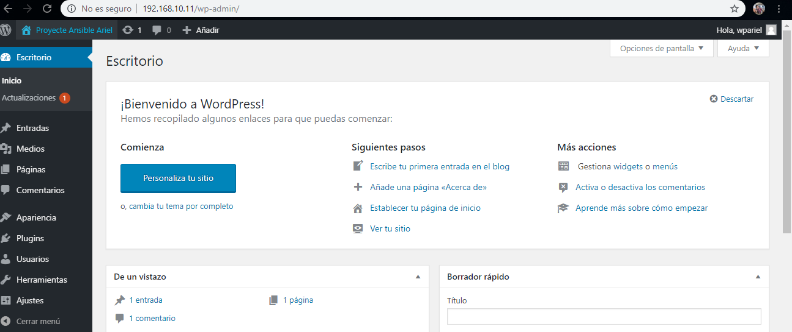

